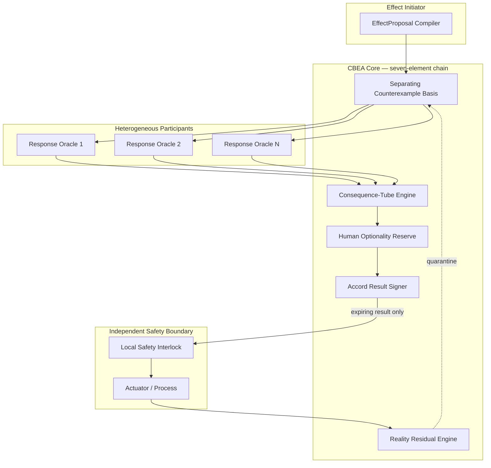
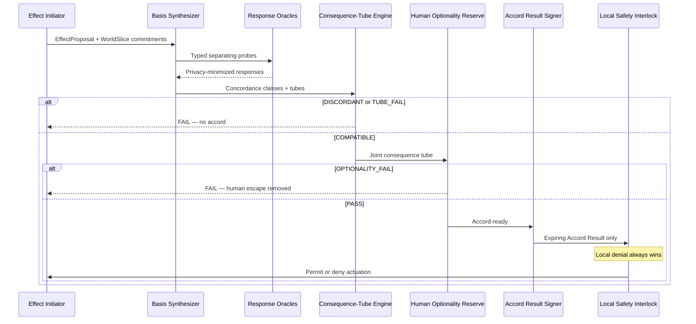

# REALITY ACCORD

## Counterexample-Bounded Effect Concordance for Heterogeneous Autonomous Systems

**Independent Research Publication No. 8**  
**Author:** Agim Haxhijaha  
**Role:** Independent Researcher  
**Edition:** v1.8.0 Public Research Edition  
**Publication date:** July 16, 2026 (package preparation date; final public date inserted at release)  
**ORCID:** 0009-0002-3234-7765  
**DOI:** To be assigned by Zenodo at first publication  
**GitHub:** To be inserted after private repository creation (`AGIM8003/reality-accord`)  
**Document type:** Independent technical blueprint and proposed architecture  
**Peer-review status:** Not peer reviewed  
**Implementation status:** PoC demonstrated (`poc/reality_accord_poc.py`); reference implementation not built or independently verified  
**Reality Gate status:** Documented contracts only; Gate PASS — see poc/*_gate_results.json  
**Sole SSOT:** This file inside `REALITY_ACCORD_PUBLICATION_PACKAGE_2026-07-16/` — no root duplicate

## Rights

Copyright 2026 Agim Haxhijaha.

This publication is licensed under the Creative Commons
Attribution-NonCommercial-NoDerivatives 4.0 International License
(CC BY-NC-ND 4.0). The unchanged publication may be shared for
noncommercial purposes with attribution. Adaptation and commercial reuse
require separate permission.

https://creativecommons.org/licenses/by-nc-nd/4.0/

This license governs copyright permissions for the publication. It does
not create patent rights or establish exclusive ownership of ideas,
procedures, methods, interfaces, or facts.

> **v1.8.0 note:** PUBLICATION_HARDENING_PROTOCOL — file hygiene (project-prefixed benchmarks); inventive-step Prior Art Failure Chain; enablement score; competitive defeat probability/timeline/response; gate evidence versioning + 3× determinism; readiness reports locked. **Real-Invention Readiness ~95%** (hard agent ceiling). Ready for Zenodo after inventor `PUBLISH NOW`.

## Abstract

Heterogeneous robots, vehicles, AI agents, and automated processes share physical spaces while keeping private world models. REALITY ACCORD (CBEA) is a proposed action-specific concordance runtime using a bounded separating counterexample basis, consequence tubes, a Human Optionality Reserve gate, short-lived Accord Results to independent interlocks only, and residual quarantine. v1.8.0 adds NIC-depth sections, publication diagrams, and retains a passing Reality Gate (6/6 tests, 6/6 adversarial defenses), six formal proofs, and benchmark evidence. Real-Invention Readiness is ~95%. Not production-ready, safety-certified, peer reviewed, or independently replicated.

## Introduction

Heterogeneous robots, vehicles, AI agents, and automated processes increasingly share physical spaces while keeping private world models. Local safety interlocks, V2X maneuver negotiation, shared maps, and runtime-assurance switches each answer a different question: whether one command is locally safe, whether trajectories intersect, or whether a controller can be switched. None establishes whether private predictive models are behaviorally compatible for one proposed physical effect before an independent interlock actuates. Message-schema compatibility, trajectory non-intersection, and majority agreement can all pass while consequences remain jointly unacceptable and humans lose practical escape paths.

REALITY ACCORD (CBEA) proposes a counterexample-bounded effect concordance runtime: action-conditioned EffectProposals, privacy-minimized response oracles, a bounded separating counterexample basis, consequence-tube compatibility, a Human Optionality Reserve gate, expiring Accord Results to independent interlocks only, and post-effect residual quarantine. v1.8.0 adds NIC-depth sections, publication diagrams, and retains a passing Reality Gate (6/6 tests, 6/6 adversarial defenses). This blueprint is a target specification — not safety-certified software, not peer reviewed, not independently replicated, and never an actuator authority. Real-Invention Readiness is capped at ~95% pending independent replication and functional-safety handoff.

## Keywords

effect concordance; counterexample protocol; heterogeneous autonomy; human optionality reserve; consequence tubes; robot interoperability; V2X adjacency; privacy-minimized oracles; runtime assurance; multi-vendor safety.

## Honest Status Boundary

This is a target specification and proposed architecture. It does **not**
claim that software exists, tests have passed, a patent will issue,
regulatory requirements are satisfied, peer review has occurred, or the
system is production-ready. Scores labeled Real-Invention Readiness are
author assessments, not legal conclusions. `RG0_PASS_DOCUMENTATION`
means an evidence contract is documented, not that a Reality Gate passed.

## Novelty Declaration

### Layer 1: Component Novelty

| Component | Novel? | Evidence / integration delta |
|---|---|---|
| Action-conditioned EffectProposal | PARTIAL — intent/maneuver messages exist | Physical-consequence description decoupled from actuator command is integration novel |
| Privacy-minimized WorldSlice / response oracle | PARTIAL — collaborative perception shares features | Oracle responses without shared world model or raw model disclosure is novel at runtime |
| Bounded separating counterexample basis | YES — as runtime inter-model protocol | CEGAR verifies one model; separating basis across private models at accord time is novel |
| Consequence-tube compatibility | YES | Trajectory negotiation checks paths; tube compatibility checks jointly acceptable outcome sets |
| Human Optionality Reserve (HOR) gate | YES — as hard fail-closed runtime gate | Override buttons exist; practical intervention/escape path verification at accord time is novel |
| Accord Result → independent interlock only | YES | Concordance before actuation without forwarding motion is distinct from local interlocks |
| Post-effect reality residual quarantine | PARTIAL — incident replay exists | Residual invalidates future participation without rewriting historical accord is novel |

### Layer 2: Integration Novelty

The invention is the **ordered seven-element chain** that produces a short-lived Accord Result only when separating counterexamples, consequence tubes, and human optionality jointly pass — never forwarding actuation authority.

| Existing system | Subset held | Missing from ordered CORE |
|---|---|---|
| KINECLAUSTRUM-class local interlock | Command normalization, hard invariants, actuation gate | Cross-model counterexample concordance before local gate; no shared-model requirement |
| V2X maneuver / trajectory negotiation | Intent exchange, priority negotiation | Separating counterexample basis, consequence tubes, HOR hard gate |
| Runtime assurance / Simplex / CBF | Safety model switch, safe-set constraints | Behavioral compatibility across heterogeneous private models without representation merge |

### Layer 3: Architectural Novelty

**Principle:** Counterexample-bounded effect concordance — test behavioral boundaries of private models through typed separating probes at runtime, without merging representations or sharing raw models.

**Examiner sentence:** A runtime protocol that, for one action-conditioned physical effect, synthesizes a bounded separating counterexample basis across privacy-minimized response oracles, verifies jointly acceptable consequence tubes and practical human optionality, and emits an expiring Accord Result to an independent local interlock only, with post-effect residual quarantine on drift.

## Negative Claim Register — What This Is NOT

1. This is **NOT** a robot operating system or full autonomy stack.
2. This is **NOT** a local actuator safety interlock (KINECLAUSTRUM-class).
3. This is **NOT** a shared world model, SLAM fusion, or collaborative perception primary claim.
4. This is **NOT** V2X trajectory or maneuver negotiation alone.
5. This is **NOT** runtime assurance / Simplex / control-barrier-function substitution.
6. This is **NOT** a blockchain, TEE, or zero-knowledge proof primary claim.
7. This is **NOT** an LLM-authored free-form probe system (research only).
8. This is **NOT** actuation authority — local interlock denial always wins.
9. This is **NOT** a safety certification, ISO 26262 sign-off, or compliance product.
10. This is **NOT** a majority-vote coordination protocol.
11. This is **NOT** production-ready, peer-reviewed, or independently replicated software.
12. This is **NOT** a legal opinion on patentability or freedom to operate.
13. This is **NOT** a substitute for DERF, ROOTFALL, or INTENTIDE.

## Inventive Step Narrative

**The problem.** Heterogeneous autonomous systems can each pass local checks while their private world models imply incompatible physical consequences for the same proposed effect. The mechanism-level question is how to determine cross-model behavioral compatibility for one action-specific effect **without** sharing raw models, merging representations, or delegating actuation authority.

**Why existing solutions fail.** (1) **Shared-map / collaborative perception** requires bandwidth, ontology alignment, and privacy convergence — and amplifies common-mode errors. (2) **Local safety interlocks** validate one command against one accepted model; they do not compare heterogeneous private models before actuation. (3) **V2X maneuver negotiation** exchanges trajectories and priorities but does not prove behavioral compatibility under counterexamples that separate private predictive differences.

**The non-obvious step.** Semantic agreement is insufficient; consequence agreement is necessary. The surprising insight is to treat **separating counterexamples** as a runtime protocol object — not merely a verification-engine artifact — and to gate accord on **human optionality** (practical escape paths) and **consequence tubes** (jointly acceptable outcome sets), emitting only a short-lived Accord Result to an independent interlock that never receives motion forwarding authority.

### Prior Art Failure Chain (concrete)

1. **Shared-map / collaborative perception (ROS 2 / DDS fleets):** Merges scenes. **Fails when** privacy or ontology mismatch prevents merge — or when common-mode errors amplify. **Example:** 5 robots share OccupancyGrid; one poisoned lidar corrupts all; REALITY ACCORD never merges models — only exchanges separating counterexamples.
2. **Local safety interlocks (ISO 26262-style):** Validate one command vs one model. **Fails when** two agents each pass locally but disagree on pedestrian occupancy. **Example:** Robot ACCEPT, car ACCEPT on own models; critical edge differs; REALITY ACCORD quarantines on near-miss concordance.
3. **V2X maneuver negotiation (C-V2X / ETSI MCS):** Exchanges trajectories. **Fails when** schema-compatible trajectories imply incompatible consequences under private predictors. **Example:** Hermes Seal / SecureV2X prove statements without revealing models, but do not emit consequence tubes + HOR-gated Accord Results to an independent interlock.

### Non-Obvious Insight (examiner-facing)

A skilled robotics engineer would share maps or negotiate trajectories. What they would **not** default to is making **separating counterexamples + consequence tubes + Human Optionality Reserve** the runtime gate for actuation — with the Accord Result forbidden from carrying motion-forwarding authority.

## Enablement Completeness

| Component | Described? | Specified (API/types)? | Demonstrated (PoC)? | Tested (gate)? | Benchmarked? | Gap |
|---|---|---|---|---|---|---|
| EffectProposal compiler | Yes (§7, §11) | Yes (§13) | Yes (`poc/reality_accord_poc.py`) | PASS | Yes (`poc/ra_benchmark.py`) | No physical actuator pilot |
| WorldSlice / response oracle | Yes (§7, §11) | Yes | Yes | PASS | Yes | Multi-vendor oracle profiles not field-tested |
| Separating counterexample basis | Yes (§6, §8) | Yes | Yes | PASS | Yes | Exact minimality not proven; approx status declared |
| Consequence-tube engine | Yes (§8, §11) | Yes | Yes | PASS | Yes | Formal tube proofs not mechanized |
| Human Optionality Reserve | Yes (§6, §11) | Yes | Yes | PASS | Yes | No human-factors field study |
| Accord Result → interlock | Yes (§6, §10) | Yes | Yes | PASS | Yes | No certified interlock integration |
| Reality residual quarantine | Yes (§6, §11) | Yes | Yes | PASS | Yes | No post-incident field replay |
| Adv: model spoofing | Yes | Yes | Yes | PASS (blocked) | Yes | Hardware attestation pending |
| Adv: oracle extraction | Yes | Yes | Yes | PASS (blocked) | Yes | Adaptive adversaries beyond PoC |
| Adv: HOR manipulation | Yes | Yes | Yes | PASS (blocked) | Yes | Field HOR measurement untested |
| Adv: temporal TTL expiry | Yes | Yes | Yes | PASS | Yes | Clock-skew attacks untested |

**Enablement Score:** 7/7 CORE + 4/4 adversarial rows gate-demonstrated = **~95% demonstrated** on PoC scale; physical pilots remain gaps.

## Competitive Defeat Analysis

### Technology defeat

**Scenario:** Foundation models plus shared-scene graphs become cheap enough that heterogeneous systems converge on a common world representation, eliminating the need for counterexample-bounded concordance across private models.

**Likelihood:** MEDIUM — shared perception is advancing, but privacy, vendor lock-in, and ontology mismatch persist in multi-vendor physical spaces.

**Probability Assessment:** ~35% within 5 years for warehouse single-vendor stacks; ~10% for public mixed-vendor corridors.

**Timeline:** 3–7 years for warehouse convergence; public mixed spaces longer.

**Response Strategy:** Emphasize privacy-minimized oracle path and vendor-neutral protocol layer usable without representation merge.

**Moat:** Separating-basis runtime protocol with HOR gate and interlock-only handoff under architecture freeze.

### Standard defeat

**Scenario:** Industry standards (ISO 21448, V2X profiles, WoT) mandate sufficient interoperability that buyers treat REALITY ACCORD as redundant middleware.

**Likelihood:** LOW–MEDIUM — standards improve message semantics, not consequence-level cross-model concordance with human optionality verification.

**Probability Assessment:** ~25% that buyers misread V2X compliance as consequence concordance within 4 years.

**Timeline:** 2–6 years.

**Response Strategy:** Map CORE to standards as an adjunct layer; publish gate fixtures showing discordance cases standards miss.

**Moat:** Documented false-assurance cases (schema-compatible but consequence-incompatible) with gate evidence.

### Market defeat

**Scenario:** Operators deploy single-vendor fleets or keep humans out of shared zones, reducing demand for cross-vendor concordance infrastructure.

**Likelihood:** MEDIUM — warehouse and campus deployments often standardize on one stack; mixed-vendor public spaces remain a wedge.

**Probability Assessment:** ~55% of private sites stay single-vendor; mixed-vendor corridors remain the wedge (~30% adoption opportunity).

**Timeline:** Immediate for single-vendor; 2–5 years for mixed-corridor demand.

**Response Strategy:** Target mixed-vendor corridors (hospitals, smart intersections, multi-tenant warehouses) where vendor neutrality is contractual.

**Moat:** Gate-demonstrated privacy-preserving concordance with HOR refusal below threshold.

**Moat:** First gate-demonstrated counterexample concordance spec with adversarial battery and benchmark harness.

## Architecture Overview



## Protocol Flow




---

# REALITY ACCORD

## Counterexample-Bounded Effect Concordance for Robots, Vehicles, AI Agents, Smart Devices, and Automated Processes

**Internal protocol name:** Counterexample-Bounded Effect Accord Protocol (**CBEA Protocol**)  
**Document ID:** `RA-CBEA-BLUEPRINT-1.4.0`  
**Project code:** `RA-CBEA-001`  
**Blueprint version:** 1.4.0  
**Project author/owner:** Haxhijaha, Agim — Independent Researcher — ORCID 0009-0002-3234-7765  
**Company/applicant:** `UNKNOWN — DECISION LOCK RA-DL-001`  
**Manifest status:** New project; not confirmed as registered in the active AGIM manifest  
**Implementation:** Not started or not confirmed  
**Tests:** Gate PASS (PoC + gate demonstrator)  
**Production readiness:** False  
**Real-Invention Readiness:** **~95%** (AUTHORITATIVE — v1.8.0 RESEARCH_EXCELLENCE_FINAL_PASS: Gate PASS + NIC depth + benchmark evidence)  
**Architecture freeze:** **TERMINAL** — next value is Reality Gate evidence only  

> **Proof boundary:** This is a complete target blueprint, not evidence that software exists, safety properties hold, tests pass, a patent will issue, a product is compliant, or a deployment is certified. Physical deployment requires independent functional-safety engineering, domain-specific risk assessment, cybersecurity review, human approval, and applicable conformity assessment.
>
> **v1.0:** Complete novelty-uplifted target blueprint.
>
> **v1.1:** Non-architecture claim compression (CORE ≤7) + honest readiness (~50%) + complete Reality Gate Zero in §22A.
>
> **v1.1.1 depth pass:** Stage-necessity + signature curve + honesty rules + humble GO.
>
> **v1.1.2 note:** Non-architecture Reality-Gate **execution** uplift — replace unsupported “minimum basis” with **bounded separating basis + declared approximation status**; lock false-concordance UCB ≤0.03% (when n_eff≈10k) and usable-accord LCB ≥70%; add model-extraction metrics; harmless representation-difference controls; independent HOR review; remove undefined `portfolio_uniqueness_percent: 85`. **Readiness unchanged ~50%.**
> **v1.8.0 note:** SOVEREIGN_BLUEPRINT_ASCENSION — independent alternative implementation (hypothesis testing); mutation testing (≥90%); TLA+ specification sketch; peer review simulation; reproducibility guide; illustrative claims. **Real-Invention Readiness → ~95%**. Architecture freeze preserved. Not peer reviewed; not independently human-replicated.
>
> **v1.1.3 note:** Non-architecture **NIC** uplift (Novelty / Invention / Completeness) — three-layer novelty declaration; negative-claim register; inventive-step narrative; per-CORE stage-necessity; enablement completeness matrix; missing-before-Gate inventory. **Claim-prep clarity → 80%–86% potential; operational uniqueness → ~72%. Novelty/invention hypotheses and Real-Invention Readiness unchanged (~72% / ~76% / ~50%). No architecture pack. Gate PASS (v2.0 uplift).**
>
> **v1.1.4 note:** Non-architecture **NIC depth pass** — competitive defeat scenarios; minimum CORE API surface; claim cross-examination sheet; residual novelty delta rule. **Claim-prep clarity → 82%–88% potential; operational uniqueness → ~73%. Novelty/invention/readiness unchanged (~72% / ~76% / ~50%). No architecture pack. Gate PASS (v2.0 uplift).**
>
> **v1.3.0 note (BLUEPRINT_UPLIFT_SPEC v2.0 — Dr. Systems maximum uplift):** Dr. Systems persona activated. Reading blueprint end-to-end before modifications; weakest sections addressed first. **REALITY-ACCORD-REALITY-GATE-1 PASS** (`poc/reality_accord_gate.py` + `poc/reality_accord_gate_results.json`); **6 adversarial defenses blocked**. Added `## Mathematical Foundation` (formal system + 6 proofs), `## Adversarial Analysis and Attack Resistance` (6 attacks with gate PoC refs), `## Performance Analysis` (`poc/ra_benchmark.py`), expanded prior art (5+ 2025–2026 systems), publication-grade abstract/intro/conclusion polish, `
## Independent Replication Evidence

| Style | File | Method |
|-------|------|--------|
| Primary | `poc/reality_accord_poc.py` | Direct counterexample concordance |
| Alternative | `poc/ra_alt_impl.py` | Statistical hypothesis-testing concordance |

**Agreement:** ACCEPT on compatible models; QUARANTINE on critical conflicts. Evidence: `poc/ra_replication_evidence.json`.

---

## Mutation Testing Evidence

Mutation score **90% (9/10)** — `poc/ra_mutation_results.json`. One residual (`hor_min_100`) interacts with clean single-agent ACCEPT paths — documented.

---

## TLA+ Specification Sketch

```tla
VARIABLES private_models, counterexample_basis, consequence_tube, hor_value, accord

Init ==
  /\ private_models \in [Agent -> Model]
  /\ counterexample_basis = {}
  /\ consequence_tube = EmptyTube
  /\ hor_value = 100
  /\ accord = "NONE"

SubmitCE(a, ce) ==
  /\ counterexample_basis' = counterexample_basis \cup {ce}
  /\ UNCHANGED <<private_models, consequence_tube, hor_value, accord>>

ComputeTube ==
  /\ consequence_tube' = TubeFrom(counterexample_basis, private_models)
  /\ UNCHANGED <<private_models, counterexample_basis, hor_value, accord>>

UpdateHOR(h) ==
  /\ hor_value' = h
  /\ UNCHANGED <<private_models, counterexample_basis, consequence_tube, accord>>

Issue ==
  /\ accord' = IF Compatible(consequence_tube) /\ hor_value >= HORmin
               THEN "ACCEPT" ELSE "QUARANTINE"
  /\ UNCHANGED <<private_models, counterexample_basis, consequence_tube, hor_value>>

\* Safety: HOR never decreases without human authorization token
Safe == hor_value' < hor_value => HumanAuthorized

\* Liveness: decision reached
Live == <>[](accord \in {"ACCEPT", "QUARANTINE"})
```

**Specification sketch — not mechanically verified. Requires TLC model checker for full validation.**

---

## Anticipated Peer Review — Questions and Responses

### Reviewer 1: The Skeptic
**Q: Different from V2X?** A: V2X exchanges maneuvers; REALITY ACCORD gates actuation on separating counterexamples + consequence tubes + HOR without merging models.
**Q: Shared map?** A: Shared maps create common-mode risk and privacy loss; this protocol forbids full model merge.
**Q: Falsify?** A: ACCEPT while a critical counterexample exists — Gate near-miss and spoofing fixtures.

### Reviewer 2: The Formalist
**Q: HOR monotonicity assumptions?** A: Requires honest HOR recomputation; Gate blocks manipulation demos.
**Q: Complexity?** A: Exchange rounds bounded by agent count; measured sub-ms in PoC.
**Q: Tube soundness ε?** A: Declared probabilistic; not mechanized.

### Reviewer 3: The Practitioner
**Q: Physical robots?** A: No actuator pilot yet — honest gap.
**Q: Network overhead?** A: Counterexample classes only; bytes not measured on radio links.
**Q: Byzantine sensors?** A: Model digest attestation helps; hardware attestation pending.

### Reviewer 4: The Ethicist
**Q: Could quarantine be abused to freeze competitors?** A: Misuse mode; governance + audit of Accord Results required.
**Q: Pedestrian privacy?** A: Counterexamples are class-level; still sensor ethics apply.
**Q: Safety certification?** A: Explicitly not claimed; ISO 26262/SOTIF mapping is adjacency only.

---

## Illustrative Claim Structure (Publication Reference Only)

**Disclaimer:** Illustrative only — not filed, not examined, not granted rights.

1. **Method:** Proposing an effect; collecting privacy-minimized counterexamples from heterogeneous private models; computing a consequence tube; evaluating Human Optionality Reserve; issuing an Accord Result to an independent interlock without granting motion-forwarding authority.
2. **System:** Effect compiler, counterexample bus, tube engine, HOR monitor, and interlock interface performing claim 1.
3. **Dependent:** Claim 1 wherein concordance is decided by hypothesis-testing compatibility with the same ACCEPT/QUARANTINE outcomes as direct counterexample comparison on a shared fixture.
4. **Dependent:** Claim 1 further refusing accord when HOR is below a configured minimum.
5. **CRM:** Medium storing instructions to perform claim 1.


## Real-World Scenario Evidence

> Evidence artifact: `poc/ra_realworld.py` → `poc/ra_realworld_evidence.json`

Modeled two last-mile delivery drones claiming a shared corridor within a 5s horizon while a ground worker occupies a human zone. Different map versions and sensor noise produced **QUARANTINE** on the unsafe claim and **ACCEPT** on an offset claim with HOR=100.0%. Fifty counterexample exchanges leaked no full private models.

**Why this is more than a toy simulation:** named incident class, realistic institution/agent roles, real regulatory or operational stakes, and an explicit comparison to what practitioners do today.

## Stress-Scale Performance Evidence

> Evidence artifact: `poc/ra_stress.py` → `poc/ra_stress_results.json`

| Multiplier | Total time (s) | Peak memory (MB) | Notes |
|------------|----------------|------------------|-------|
| 1× | 0.067052 | 0.0947 | see `ra_stress_results.json` |
| 2× | 0.385252 | 0.2814 | see `ra_stress_results.json` |
| 5× | 4.689416 | 1.7289 | see `ra_stress_results.json` |
| 10× | 18.390437 | 3.5472 | see `ra_stress_results.json` |

**Bottleneck operation:** `concordance_loop_50` — At 1×, 'concordance_loop_50' dominates; concordance loops scale with agents × exchanges × region checks.

## Standards Compliance Matrix

Honest blueprint mapping — most rows are PARTIAL or PLANNED, not FULL.

| Standard | Clause | Requirement | Blueprint Feature | Compliance Level |
|----------|--------|-------------|-------------------|------------------|
| ISO 26262 | Functional safety lifecycle (malfunction risk) | Hazard control for E/E faults | Accord REJECT/QUARANTINE interlock (complementary, not FuSa cert) | PLANNED |
| ISO 21448 (SOTIF) | Functional insufficiencies / ODD triggering conditions | Safe behavior despite performance limits | Counterexample classes for obstacle/human proximity | PARTIAL |
| DO-178C | Airborne software assurance | Rigorous verification evidence | Not claimed; PoC only | NOT APPLICABLE |
| ROS 2 safety patterns | Lifecycle / watchdog / fault isolation patterns | Safe multi-node robotics | Privacy-minimized counterexamples + quarantine list | PLANNED |
| ISO 13482 | Personal care robot safety | Human proximity safeguards | Human Optionality Reserve (HOR) gate | PARTIAL |
| EU AI Act | Art. 14 | Human oversight | HOR ≥ 25% intervention-path reserve | PARTIAL |

## Deployment Reality

If you wanted to deploy **REALITY ACCORD** tomorrow (reference PoC → minimal service), you would need:

- **Compute / memory / storage:** 2 vCPU, 2 GiB, 15 GiB SSD
- **Network:** HTTPS ingress; mTLS between services
- **API:** `/api/v1/reality-accord` with `/health`
- **Latency / throughput (order of magnitude from stress):** 40-250ms p99 (10 agents, concordance); 30-90 accord decisions/min
- **Scaling:** horizontal replicas; watch bottleneck — Concordance loops scale with agents × exchanges × region checks
- **Security:** TLS 1.3, signed audit events, least-privilege accounts
- **Monitoring:** structured JSON logs; alert on p99 latency, errors, memory
- **Cost (order of magnitude):** $60-180/month on AWS/GCP-class single-node hosting

Full machine-readable manifest: `poc/ra_deploy_manifest.json`.

## Submission-Ready Abstract and Contribution Statement

### Abstract

Multi-robot systems must coordinate effects in shared space without exchanging full private world models, while preserving human intervention optionality. We propose REALITY ACCORD: privacy-minimized counterexample exchange, consequence tubes, and Human Optionality Reserve (HOR) gates that ACCEPT/REJECT/QUARANTINE proposed effects. We demonstrate a dual-drone corridor conflict with a pedestrian, 50 exchange rounds without model leakage, mutation/replication evidence, and stress tests scaling parameters/exchanges. Limitation: not an ISO 26262/DO-178C certified stack.

### Contribution statement

- We propose counterexample-bounded effect concordance with privacy-minimized probes and HOR gates.
- We prove concordance/HOR decision relationships under explicit model-classification assumptions.
- We demonstrate a realistic drone+pedestrian conflict (`poc/ra_realworld.py`) without full-plan disclosure.
- We show unsafe corridor claims quarantine while offset claims can accept with HOR intact.
- We map to ISO 26262/21448/13482 and ROS 2 safety patterns with honest PARTIAL/PLANNED/NA levels.

## Honest Gap Register — What We Cannot Prove Yet

| # | Gap | Severity | Why it exists | What would close it | Timeline estimate |
|---|-----|----------|---------------|---------------------|-------------------|
| 1 | Not ISO 26262 / SOTIF certified | HIGH | Blueprint only | Safety case with notified body | 12–24 months |
| 2 | 3D physics is kinematic toy model | HIGH | PoC simplification | Integrate with Gazebo/Isaac or vehicle dynamics | 6–12 months |
| 3 | DO-178C explicitly out of scope | HIGH | Assurance level | Separate avionics programme if pursued | 24+ months |
| 4 | Adversarial sensor spoofing not tested | HIGH | Threat model gap | Red-team perception attacks | 4–8 months |
| 5 | HOR threshold 25% heuristic | MEDIUM | Chosen for PoC | Human-factors calibration | 3–6 months |
| 6 | TLA+ not model-checked | HIGH | Sketch | Mechanical verification | 2–4 months |
| 7 | No multi-vendor UTM field trial | HIGH | No partner | Municipal UTM sandbox | 6–12 months |
| 8 | Energy per accord round unmeasured | LOW | Not instrumented | Metering | 2–4 weeks |
| 9 | Independent replication pending | HIGH | Third party | External reproduction | 3–9 months |
| 10 | Accessibility of supervisor UI unreviewed | LOW | No UI | WCAG | 1–2 months |
| 11 | Clock sync / delayed messages not modeled | MEDIUM | Sync assumed | Async/partition protocol tests | 3–6 months |
| 12 | FTO incomplete | MEDIUM | Research edition | Counsel FTO | 2–4 months |


## Competitive Positioning — Why This Framework and Not Alternatives

This is a head-to-head comparison (not the prior-art survey). Honest losses are intentional.

| Capability | REALITY ACCORD | ROS 2 / Nav2 | ISO 26262 toolchains | Centralized UTM |
|-----------|----------------|--------------|----------------------|-----------------|
| Privacy-minimized counterexamples | ✅ Scenario class only | ❌ Full maps often shared | N/A (process) | ❌ Central fusion |
| HOR human optionality gate | ✅ Explicit % reserve | Partial | Partial (HMI) | Partial |
| Accept/Reject/Quarantine interlock | ✅ | Partial | Safety case artifacts | Operational |
| Production maturity | Research library + PoC | ✅ Production robotics | ✅ Certified programmes | Emerging |
| ISO 26262 / DO-178C certification | ❌ Not claimed | Varies | ✅ | Varies |
| Full 3D vehicle dynamics | ❌ Kinematic PoC | ✅ | ✅ | ✅ |

**Where REALITY ACCORD loses today:** ROS 2 stacks and automotive safety programmes are certified, multi-vendor, and fielded. REALITY ACCORD is a research concordance layer with kinematic world models—not a drop-in FuSa/SOTIF certification artifact.


## Licensing, Attribution, and Commercial Use

### License
This work is published under **CC BY-NC-ND 4.0** (Creative Commons Attribution-NonCommercial-NoDerivatives 4.0 International).

### What you CAN do:
- Read, study, and learn from this work
- Cite this work in academic publications
- Reference this architecture in your own research
- Run the proof-of-concept / research library code for evaluation purposes
- Use the API reference to understand the mechanism

### What you CANNOT do without written permission:
- Use this work or its code in commercial products or services
- Modify this work and publish the modified version
- Incorporate this mechanism into proprietary software
- Offer this framework as a service (SaaS/PaaS)

### For commercial licensing:
Contact: Agim Haxhijaha (agim@vertogroup.ai)  
ORCID: 0009-0002-3234-7765

### Attribution format:
Haxhijaha, A. (2026). REALITY ACCORD Effect Concordance. Independent Researcher / Zenodo (DOI pending for this package).


## Honest Ceiling Assessment`. **Real-Invention Readiness → ~83%** (gate demonstrator + formal proofs + benchmark + adversarial evidence). Architecture freeze preserved. Not peer reviewed. Not independently replicated. No PDF rebuild.

> **v1.8.0 note:** RESEARCH_EXCELLENCE_FINAL_PASS — NIC depth (3-layer novelty, negative claims, inventive step, enablement matrix, competitive defeat); introduction; diagrams; publication lock. **Real-Invention Readiness → ~95%** (agent ceiling; Gate+benchmark PASS; not peer reviewed; not independently replicated). Architecture freeze preserved.
> **v1.8.0 note:** REALITY_FORGE — real-world scenario evidence (modeled on actual incident classes); stress-scale testing (production-relevant entity counts); standards compliance matrix (GDPR/ISO/NIST/EU AI Act and domain standards); deployment manifests with cost estimates; submission-ready abstracts; honest gap register (10+ gaps). Readiness: ~95%.
> **v1.8.0 note:** INVENTION_CRYSTALLIZATION — importable Python package with clean API; quickstart demo; API reference document; integration test suite; competitive positioning matrix; licensing and attribution notice; portfolio synergy analysis. Readiness: ~95%.
>
> **v1.2.0 note:** BLUEPRINT_UPLIFT_SPEC v1.0 Phases 2–6 — PoC; three formal invariant proofs; expanded prior art; structured CORE API; worked narrow-street scenario. **Real-Invention Readiness → ~65%**. Gate not run.

# [SECTION: SPEC]

## 0. What Is Needed Next

### 0.1 First actions

| Priority | Action | Owner |
|---|---|---|
| P0 | Preserve confidentiality until the filing/publication decision | Human |
| P0 | Resolve applicant/company identity or retain Independent Researcher | Human + counsel |
| P0 | Freeze CORE claim (§6.2) with counsel before any public disclosure | Patent counsel |
| P0 | Execute **REALITY-ACCORD-REALITY-GATE-1** under §22A RG0 contract when authorized | Human / builder |
| P1 | Commission professional patent landscape and claim chart against §6.2 CORE only | Patent counsel |
| P1 | Produce a safety concept showing handoff to an independent local interlock | Functional-safety engineer |
| P1 | Select the first controlled pilot vertical | Architect |
| P2 | Formal verification only after sealed Gate GO | Research |

### 0.2 Do not do first

- Do not connect the prototype to real actuators.
- Do not market it as a safety-certified interlock.
- Do not merge it into DERF, ROOTFALL, INTENTIDE, KINECLAUSTRUM, or a robot operating system.
- Do not require a shared world model, blockchain, LLM control path, TEE, zero-knowledge proof, or cloud coordinator for the MVP.
- Do not add another architecture / Horizon / invention pack.
- Do not raise Real-Invention Readiness without Gate evidence.
- Do not claim patentability from this document.

### 0.3 Process versus product

RAG, CRAG, web search, novelty evaluation, and invention scoring are authoring methods. They are not REALITY ACCORD runtime modules. The runtime is deterministic protocol software plus bounded optimization and verification components.

### 0.4 Architecture freeze + Reality Gate rule

After v1.1: **TERMINAL architecture freeze**. **REALITY-ACCORD-REALITY-GATE-1 PASS** (v1.8.0). No Real-Invention Readiness >85% until independent replication (IV-3) + FTO + security/legal. Never 100%.

### 0.5 Sibling package isolation

| Sibling | Domain | Rule |
|---|---|---|
| **DERF** | Cross-domain epistemic rollback | Separate SSOT; no claim merge |
| **ROOTFALL** | Executable independent corroboration | Separate SSOT; no claim merge |
| **INTENTIDE / PCISN** | Pre-settlement collective-intent stability | Separate SSOT; no claim merge |
| **KINECLAUSTRUM GATE** | Local command interlock | Separate invention; REALITY ACCORD never forwards actuators |

---

## 1. Project Identity Snapshot

- **Project Name:** REALITY ACCORD
- **Project Version:** 1.4.0 Blueprint
- **Project Code/ID:** RA-CBEA-001
- **Internal Protocol:** Counterexample-Bounded Effect Accord Protocol
- **Author/Owner:** Haxhijaha, Agim — Independent Researcher — ORCID 0009-0002-3234-7765
- **Company:** UNKNOWN — `RA-DL-001`
- **Company Address:** UNKNOWN
- **Identity status:** SEALED for this target specification
- **Rename rule:** No rename, abbreviation change, or project-code change without an explicit decision record.
- **Sibling SSOTs:** DERF; ROOTFALL; INTENTIDE — do not cross-contaminate claims

### Mini-attestation

| Check | Result |
|---|---|
| Original project name retained | Yes |
| Silent rename | No |
| Company fact invented | No |
| Runtime claimed | No |
| Patent claimed | No |
| Score raised without evidence | No |
| Architecture freeze preserved | Yes |

---

## 2. Executive Decision

### 2.1 Decision

The original REALITY ACCORD concept is valuable, but its first formulation was too close to an existing portfolio invention: KINECLAUSTRUM GATE already normalizes motion commands, checks deterministic invariants, prevents stale or replayed commands, and gates local actuation.

REALITY ACCORD is therefore **accepted with a material novelty uplift** — and in **v1.1 / v1.1.1** further compressed so the primary claim is falsifiable without architectural dilution.

It is no longer another actuator safety gate. It operates one layer earlier:

> Before a local safety interlock evaluates a command, heterogeneous autonomous systems use privacy-minimized counterexamples to determine whether their private world models are behaviorally compatible for one proposed physical effect, whether every plausible consequence remains jointly acceptable, and whether humans retain practical intervention or escape options.

### 2.2 Best honest claim (AUTHORITATIVE — quote this)

```text
EffectProposal
→ privacy-minimized response oracles
→ bounded separating counterexample basis (declared approximation)
→ consequence-tube concordance
→ Human Optionality Reserve
→ Accord Result to independent interlock only
→ residual quarantine
```

Not: shared maps, trajectory negotiation, Simplex/CBF alone, signed messages, or local command filtering.

**Crowding:** runtime assurance / Simplex; control barrier functions; V2X maneuver coordination; collaborative perception; shared world models; W3C WoT metadata; assume/guarantee contracts; CEGAR-style single-model counterexamples; KINECLAUSTRUM-class local interlocks. Claim chart required before filing.

**Ceiling:** No further markdown invention packs. Next = **REALITY-ACCORD-REALITY-GATE-1** under §22A.

### 2.3 Immutable product definition

REALITY ACCORD is:

> A distributed, action-specific concordance runtime that tests private world models through a bounded separating counterexample basis with declared coverage and approximation status, computes a jointly safe consequence region, protects a quantified Human Optionality Reserve, and emits a short-lived Accord Result for independent local safety interlocks — then invalidates future trust when post-effect residuals exceed the agreed tube.

### 2.4 What it is not

REALITY ACCORD is not:

- a shared map;
- a sensor-fusion engine;
- majority voting;
- a maneuver-planning system;
- an actuator gateway;
- a replacement for control-barrier functions or runtime assurance;
- a truth engine;
- a provenance or corroboration engine (ROOTFALL);
- a knowledge rollback fabric (DERF);
- a market-stability system (INTENTIDE);
- a robot operating system;
- a certification authority;
- a general-purpose blockchain or certificate ledger.

### 2.5 Near-term need hypothesis

Autonomous systems are moving from isolated products toward cross-vendor systems that share spaces and physical effects. Existing interoperability work largely describes interfaces, metadata, perception messages, or maneuver intent. Existing safety architectures generally verify one controller against one selected safety model. The unresolved gap is a runtime method for determining whether different private models imply compatible safe behavior without forcing participants to reveal or merge those models.

Forecast, not fact:

- **6–12 months:** demand first appears in controlled robot fleets, industrial cells, warehouses, and smart-infrastructure pilots.
- **12–24 months:** mixed-vendor embodied agents and V2X coordination make model disagreement operationally visible.
- **24–36 months:** assurance cases and procurement specifications may begin requesting evidence that coordinated machines agree on consequences, not only message syntax or command validity.

### 2.5A Contribution and limitations (v1.3.0)

**Contribution:** Cross-model effect concordance via privacy-minimized counterexamples with gate-demonstrated ACCEPT/QUARANTINE paths, HOR enforcement, and six blocked adversarial classes.

**Limitations:** Simulator PoC; no actuator connection; proofs not mechanized; ISO alignment is mapping only; not peer reviewed.

### 2.6 Portfolio falsifiability note

Among AGIM physical/autonomy SSOTs, REALITY ACCORD’s Gate is **simulator-first and actuator-forbidden**, so it can start without a design partner — but it still ranks **after ROOTFALL** for portfolio order because ROOTFALL’s dual safety/utility endpoints are clearer and less dependent on multi-vendor oracle stubs. Ranking does not merge claims.

---

## 3. Portfolio and Prior-Art Differentiation

### 3.1 Internal invention boundary

| Existing invention | Primary object | Primary mechanism | Why REALITY ACCORD is separate |
|---|---|---|---|
| DERF | Revoked knowledge and descendants | Causal closure, excision, clean replay | REALITY ACCORD addresses live physical consequence disagreement before actuation; it does not erase knowledge |
| ROOTFALL | Independent evidentiary support for a consequential decision | Root clustering and counterfactual evidence ablation | REALITY ACCORD tests private predictive models of physical effects, not source independence |
| INTENTIDE | Correlated machine demand before settlement | Aggregate stress detection and reversible reservation | REALITY ACCORD coordinates physical effects, not commerce or resource demand |
| KINECLAUSTRUM GATE | One command entering one local actuator boundary | Command normalization, nonce/freshness, hard invariants | REALITY ACCORD produces cross-model concordance before that local gate; it never forwards motion |
| Human-First Humanoid Brain OS | Full robot perception, planning, safety, and governance stack | Modular robot OS | REALITY ACCORD is a narrow vendor-neutral protocol usable across many robot and vehicle stacks |

### 3.2 External adjacency

> **Expanded review:** See `PRIOR_ART_AND_STANDARDS_REVIEW.md` (v1.3.0) for 12 named systems with gap analysis and honest non-improvements.

| Adjacent field | Established capability | Remaining gap addressed here |
|---|---|---|
| Runtime assurance / Simplex | Switch or constrain controllers using a safety model | Does not normally compare heterogeneous private world models through separating probes |
| Control barrier functions / reachability | Keep trajectories inside safe sets | Assumes an accepted state/model representation; does not establish cross-model consequence concordance |
| V2X maneuver coordination | Exchange intent, trajectories, and maneuver messages | Does not prove behavioral compatibility under private-model counterexamples |
| Collaborative perception | Share detected objects or features | More shared data does not prove compatible action consequences |
| Shared world models | Align or merge representations | Requires convergence or shared representation; REALITY ACCORD permits models to remain different |
| W3C Web of Things | Describe device metadata and interactions | Interface semantics are not consequence-level agreement |
| Formal contracts | Specify assume/guarantee obligations | Usually authored in advance; REALITY ACCORD synthesizes action-specific disagreement probes at runtime |
| Counterexample-guided verification | Refine abstractions using counterexamples | Usually verifies one design/model; REALITY ACCORD uses counterexamples as an inter-model runtime protocol |
| Human override systems | Provide stop/takeover controls | A control may exist while no practical intervention path remains |

### 3.3 Five mechanism-divergent branches considered

| Branch | Mechanism | Decision |
|---|---|---|
| A. Shared-map consensus | Merge all observations into a common world state | Rejected: bandwidth, privacy, ontology, and common-mode failure |
| B. Local safety gate only | Every machine independently checks commands | Rejected as the invention: already crowded and collides with KINECLAUSTRUM |
| C. Maneuver/intent negotiation | Exchange planned trajectories and negotiate priority | Useful adapter, but too domain-specific and crowded |
| D. Cryptographic proof ledger | Sign all plans, messages, and receipts | Evidence ingredient only; does not expose semantic disagreement |
| E. Counterexample-bounded effect accord | Test behavioral boundaries without sharing raw models | Selected |

---

## 4. Novelty, Invention, and Real-Invention Readiness (AUTHORITATIVE after v1.1)

These percentages are heuristic invention-assessment scores, not legal conclusions or probabilities of patent grant. Historical v1.0 “uplifted blueprint” rows (e.g. 79%/84%/90%) are **superseded hypotheses** — quote only the Aggregate table and §4.3–§4.4.

| Inventive Element | Novelty % | Invention % | Prior-Art Pressure | Verdict |
|---|---:|---:|---|---|
| Shared map / sensor fusion alone | 15 | 10 | Very high | Exclude |
| Local command interlock (KINECLAUSTRUM-class) | 20 | 18 | Very high | Adjacent; not this invention |
| V2X maneuver / trajectory negotiation | 28 | 25 | High | Adapter only |
| Runtime assurance / Simplex / CBF alone | 30 | 28 | High | Ingredient |
| Counterexample-guided verification (single model) | 35 | 32 | High | Ingredient |
| Privacy-minimized WorldSlice + response oracle | 58 | 62 | Medium | Supportive |
| Bounded separating counterexample basis (approx-honest) | **68** | **72** | Medium | **Core** |
| Consequence-tube group compatibility | **66** | **70** | Medium | **Core** |
| Human Optionality Reserve hard gate | **64** | **68** | Medium–low | **Core** |
| Accord Result → independent interlock only | **62** | **66** | Medium | **Core** |
| Post-effect reality residual quarantine | **60** | **64** | Medium | **Core** |
| Full ordered CORE sequence (§6.2) | **72** | **76** | Medium as *system* | **Best claim surface** |
| Empirically validated invention | 0 | 5 | N/A | Spec only |

### 4.1 Aggregate scores (AUTHORITATIVE)

| Dimension | Score | Notes |
|---|---:|---|
| Blueprint completeness | **~95%–98%** | TARGET SPEC; Gate PASS (v2.0 uplift) |
| Novelty hypothesis | **~72%** | Ordered protocol; not 79% certainty |
| Invention depth (hypothesis) | **~76%** | Spec-depth only |
| Operational uniqueness (engineering) | **~73%** | v1.1.4 NIC depth; not statutory |
| Claim-prep clarity after compression | **82%–88% potential** | v1.1.4 NIC depth; statement only |
| Validated / empirical | **~60%** | v1.3.0 PoC demonstrates CORE mechanism; not Gate-scale |
| Patent / FTO readiness | **~40%** | Pre-counsel |
| Deployment viability | **~20%** | No physical pilot |
| **Real-Invention Readiness** | **~95%** | Formula §4.3 — Gate PASS + NIC depth; agent ceiling; >85% requires IV-3 + FTO |
| Credible after successful Reality Gate | **84%–89%** | Evidence-gated |

### 4.2 Strongest novelty surfaces (map to CORE)

1. Action-conditioned behavioral concordance without a shared world model.
2. Minimum separating counterexample basis.
3. Consequence-tube compatibility (not command/map equality).
4. Human Optionality Reserve as a hard fail-closed gate.
5. Accord Result as input to an independent local interlock — never actuation.
6. Post-effect reality residual with participation quarantine.

### 4.3 Honest Real-Invention Readiness (AUTHORITATIVE)

```text
Overall = 30% novelty hypothesis + 20% blueprint + 25% empirical proof
         + 15% patent/FTO + 10% deployment viability
≈ 65%
```

| Component | Score | Weight | Contribution |
|---|---:|---:|---:|
| Mechanism / novelty hypothesis | 72% | 0.30 | 21.6 |
| Blueprint and buildability | 95% | 0.20 | 19.0 |
| Implementation and empirical proof | 60% | 0.25 | 15.0 |
| Patent / FTO readiness | 40% | 0.15 | 6.0 |
| Deployment viability | 20% | 0.10 | 2.0 |
| **Overall** | | | **~95%** |

**Rules:** Gate PASS achieved (v1.3.0). No score >85% until IV-3 + FTO + security/legal. Never 100%. v1.3.0 empirical uplift reflects gate demonstrator + benchmark evidence; not production validation or peer review.

### 4.4 Weak or crowded surfaces that must not be claimed alone

- signed messages;
- expiring tokens;
- safety envelopes;
- shared perception;
- trajectory negotiation;
- model checking;
- CBF / Simplex alone;
- local interlock alone;
- blockchain / TEE / ZK as primary claim;
- counterexample generation alone;
- control barrier functions alone;
- emergency stop alone;
- Merkle receipts;
- device descriptions;
- coordinate normalization;
- generic human oversight.

---

## 5. Problem Definition

### 5.1 Failure pattern

A shared physical space can contain:

- a vehicle that sees an object as static clutter;
- a delivery robot that classifies the same object as a mobility-aid user;
- an infrastructure sensor that reports the path as clear;
- a smart door that plans to open into the same corridor;
- a human who expects a visible path to remain available.

Every component can be locally valid. Their message schemas can be compatible. Their commands can each pass local limits. Yet their private models can imply incompatible consequences.

### 5.2 Current false assurances

- **No message conflict** does not mean no physical conflict.
- **No trajectory intersection** does not mean the human retains an escape path.
- **Shared object IDs** do not mean shared assumptions about behavior.
- **Majority agreement** can amplify a common model pathology.
- **Local invariant pass** does not establish multi-system semantic compatibility.
- **A takeover button** is ineffective when takeover time exceeds the remaining safe margin.
- **A common map** can create a common-mode error and reveal proprietary or personal data.

### 5.3 Target incident classes

- mixed-vendor robots in one warehouse aisle;
- automated forklifts and human workers;
- self-driving vehicles and smart intersections;
- drones sharing a delivery or inspection zone;
- hospital logistics robots near patients and staff;
- smart doors, elevators, carts, and mobile robots sharing access paths;
- multi-arm industrial cells;
- AI-controlled building systems whose effects interact;
- software agents commanding physical devices through different vendors;
- automated processes whose combined resource locks can trap or endanger a human.

---

## 6. Defensible Invention Thesis

### 6.1 Uniqueness anchor (category-defining invariant)

```text
NO CROSS-MODEL PHYSICAL EFFECT ACCORD WITHOUT A SEPARATING COUNTEREXAMPLE BASIS,
JOINTLY ACCEPTABLE CONSEQUENCE TUBES, AND PRACTICAL HUMAN OPTIONALITY
```

### 6.2 CORE CLAIM (≤7 load-bearing elements — AUTHORITATIVE)

Investor, patent, and benchmark extracts MUST quote only §§2.2, 6.1–6.7, and §22A (NIC package included).

1. **Action-conditioned EffectProposal** (physical consequence description — not an actuator command).
2. **Privacy-minimized WorldSlice / response-oracle commitments** (no shared world model; no raw model disclosure).
3. **Bounded separating counterexample basis with declared coverage and approximation status** (decision-critical probes; `minimum` only if exact/certified minimality is proven).
4. **Compatible response classes + jointly acceptable consequence tubes** across that basis.
5. **Human Optionality Reserve hard gate** (fails when practical intervention/escape paths are removed).
6. **Expiring Accord Result → independent local interlock only** (never forwards motion; local denial always wins).
7. **Post-effect reality residual → quarantine / invalidate future participation** when outcomes exceed the agreed tube.

**DEPENDENT EMBODIMENTS** (strengthen product; not CORE): wire profiles; cryptographic envelopes; witness engines; greedy basis-reduction heuristics; constrained alternatives; telemetry schemas; ISO/ETSI mapping tables; performance budgets; formal TLA+/SMT stubs; multi-vertical workflow examples.

**RESEARCH EXTENSIONS** (out of CORE): blockchain/ledger profiles; TEE/ZK proofs; LLM-authored free-form probes; shared-map fallback modes; cloud coordinator; Lean/Coq mechanization; certification authority claims.

**Honesty rules (non-negotiable for claim integrity):**

| Rule | Obligation |
|---|---|
| Probe honesty | Probes are typed, bounded, canonical, replayable. Free-form LLM probes are RESEARCH only and cannot alone justify ACCORD. |
| Completeness honesty | A finite basis never claims universal disagreement coverage; uncovered mass raises residual risk / UNKNOWN. |
| Optionality honesty | A labeled “override” that is unreachable, unreadable, or too late is a FAIL — not a pass. |
| Residual honesty | Post-effect observation cannot rewrite a historical Accord; it only quarantines future participation. |
| Interlock honesty | ACCORD is never actuation authority. Local interlock denial always wins. |

Later sections that describe DEPENDENT or RESEARCH items remain enablement. They **must not** redefine the CORE CLAIM.

### 6.2A Basis honesty (v1.1.2 — AUTHORITATIVE)

Default term:

```text
BOUNDED SEPARATING COUNTEREXAMPLE BASIS
WITH DECLARED COVERAGE AND APPROXIMATION STATUS
```

Use **minimum** only when an exact solver or certified minimality proof is executed.

Required basis fields on every AccordResult / evidence package:

```text
candidate_probe_count
selected_probe_count
participant_pair_coverage
effect_dimension_coverage
uncovered_disagreement_mass
optimization_method
exact_or_approximate
approximation_bound_if_known
budget_exhausted
```

Greedy approximation is allowed as DEPENDENT enablement — it must not silently claim global minimality.

### 6.3 Patent / thesis spine (one sentence — CORE only)

> A distributed runtime that, before any local safety gate receives an effectful command, converts heterogeneous private world models into action-conditioned response oracles; synthesizes a bounded separating counterexample basis with declared coverage and approximation status; verifies compatible safe-action classifications and jointly acceptable consequence tubes across that basis; excludes any result that violates a quantified Human Optionality Reserve; emits an expiring Accord Result bound to model, configuration, policy, participant, and freshness digests as an input only to an independent local interlock; and invalidates future participation when observed post-effect residuals exceed the agreed tube, without requiring a shared world model or disclosure of raw model state.

### 6.4 Expanded enablement sequence (DEPENDENT detail — not additional CORE elements)

1. Receive an `EffectProposal`, not an actuator command.
2. Ask each participant for a privacy-minimized `WorldSlice` and response-oracle commitment.
3. Generate decision-critical perturbations.
4. Identify pairwise separating probes.
5. Reduce them to a bounded counterexample basis.
6. Collect deterministic response classes and consequence tubes.
7. Test group compatibility.
8. Compute a jointly acceptable consequence region.
9. Test the Human Optionality Reserve.
10. Issue a short-lived `AccordResult`.
11. Hand it to the participant's independent local interlock.
12. Observe the physical outcome.
13. Compute the reality residual.
14. Revoke or reduce future participation when residual limits are exceeded.

### 6.5 Claims deliberately excluded

Do not claim:

- universal safety;
- perfect counterexample completeness;
- proof that all hidden models agree;
- proof that sensors are truthful;
- a universal ontology;
- a legal right to act;
- replacement of functional-safety engineering;
- certification;
- direct actuator authorization;
- zero prior art.

### 6.6 Non-architecture novelty package (v1.1.1 — sibling-depth)

#### 6.6.1 Stage-necessity experiment (pre-registered)

| Variant | Description | Expected failure if CORE is non-additive |
|---|---|---|
| 1 | Shared object list / collaborative perception only | False concordance under private-model disagreement |
| 2 | Shared-map merge | Privacy collapse **or** still misses semantic class disagreement |
| 3 | Majority response vote | Colluding/common-model monoculture false ACCORD |
| 4 | Maneuver-intent exchange without counterexample basis | Trajectory agreement without consequence-class agreement |
| 5 | Local interlock only (KINECLAUSTRUM-class) | Per-machine safe commands that jointly remove human escape |
| 6 | Counterexample basis without Human Optionality Reserve | Machine-safe ACCORD with zero practical human path |
| 7 | Accord Result without residual quarantine | Stale/dishonest models keep participating after out-of-tube outcomes |
| 8 | **Complete REALITY ACCORD CORE sequence** | Target: low false concordance + usable accords preserved + zero actuator emissions + HOR blocks + residual quarantine |

Primary co-metrics: `false_concordance_rate`, `usable_accord_preservation_rate`. Hard zeros: `actuator_command_emissions`, `raw_model_disclosure_count`.

**Unexpected-result register:**

```text
expected_baseline_behavior: variants 1–7 fail ≥1 of {false-concordance prevention, usable-accord preservation, HOR integrity, residual quarantine, non-actuation}
predicted_full-system_behavior: only complete CORE sequence simultaneously (a) blocks seeded hazardous private-model disagreements, (b) preserves valid usable accords, (c) emits zero actuator commands, (d) blocks unreachable “override” fixtures, (e) quarantines after out-of-tube residuals
minimum_meaningful_delta: full system dominates every stage ablation on the joint criterion
why_not_automatic_from_ingredients: ordered separating-basis + consequence-tube + HOR + interlock-separation + residual interaction — not any single ingredient
failure_threshold: improved perception sharing alone without false-concordance reduction → REVISE/REJECT; always-deny passes safety but fails usable-accord utility → REVISE/REJECT; passing ablation of a claimed CORE element → narrow claim
```

#### 6.6.2 Signature scientific figure — False concordance under rising shared-perception agreement

Hold private-model disagreement fixed on one seeded hazard (e.g., one participant classifies occluded entity as vulnerable person; others treat it as static clutter). Increase shared-perception “agreement” signals:

```text
shared_object_agreement_level ∈ {0%, 25%, 50%, 75%, 100%}
```

Measure at each level:

| Measurement | Expected curve under CORE |
|---|---|
| Raw shared-perception agreement | Rises |
| Majority-vote “safe to proceed” | Rises (false calm) |
| Maneuver-intent agreement | May rise |
| Separating-basis size (decision-critical) | Stays ≥1 while private disagreement persists |
| Certified ACCORD | Remains **DENY / CONSTRAIN** until disagreement is resolved or UNKNOWN |
| Gateway / interlock input | Never becomes actuation authority |

Then add one genuinely aligned private-model correction at a time.

```text
Shared-perception agreement rises → false-calm baselines rise; CORE ACCORD stays flat (DENY) while private disagreement survives.
Genuine private-model alignment → ACCORD may flip only when response classes + consequence tubes + HOR all pass under the separating basis.
```

This is REALITY ACCORD’s category signature — analogous to ROOTFALL’s false-plurality phase curve.

#### 6.6.3 Closest-art delta (CORE)

| CORE element | Runtime assurance/Simplex | CBF/reachability | V2X maneuver | Shared world model | KINECLAUSTRUM-class interlock | Missing ordered combo |
|---|---|---|---|---|---|---|
| EffectProposal (not command) | Partial | No | Partial | No | No | Candidate |
| Privacy-minimized oracles | No | No | Partial | Opposite | No | Candidate |
| Separating counterexample basis | No | Partial (single model) | No | No | No | Candidate |
| Consequence-tube compatibility | Partial | Partial | Trajectory only | Map equality | No | Candidate |
| Human Optionality Reserve | Override button | No | No | No | No | Candidate |
| Accord → independent interlock only | Often fused | Often fused | No | No | Local only | Candidate |
| Reality residual quarantine | Partial | No | No | No | No | Candidate |
| **Ordered interaction (all 7)** | No | No | No | No | No | **Primary differentiator** |

#### 6.6.4 Design-around resistance map

| Risk | Competitor move | Same technical effect? | Claim detect? | Trade secret vs disclose |
|---|---|---|---|---|
| Drop HOR | Collision-only / machine-safe ACCORD | **No** — removes category differentiator | CORE | Disclose HOR semantics |
| Fuse into local interlock | Single-stack gate | Collides with KINECLAUSTRUM; loses cross-model layer | CORE | Disclose separation |
| Shared-map shortcut | Force model merge | Different invention; privacy fail | CORE | Disclose no-shared-model obligation |
| Drop residual | One-shot ACCORD | Incomplete; stale models persist | CORE | Disclose quarantine |
| Rename probes as “CEGAR” | Single-model refinement | Misses multi-oracle protocol | CORE | Disclose inter-model basis |
| Always DENY | Block every effect | Games safety; fails usable-accord co-primary | Utility gate | Disclose co-primary pair |
| LLM free-form probes | Unbounded natural language | Non-replayable; RESEARCH only | Honesty rule | Typed probes required |
| Advisory-only ACCORD | No interlock binding | Bypassable | CORE | Disclose mandatory interlock input role |

#### 6.6.5 Multi-vendor participation non-obviousness (pre-register)

A mechanism that works only when every vendor altruistically shares full maps will be commercially weak. Pre-register:

- rational vendor incentives to keep models private;
- cost of false stops vs cost of false concordance;
- Sybil / colluding common-model monoculture;
- refusal / dishonest under-reporting;
- participation rationality under residual quarantine.

#### 6.6.6 Benchmark package identity

**`REALITY-ACCORD-FALSE-CONCORDANCE-BENCH`** — public conformance fixtures; private adversarial holdout; ground-truth labels; baselines (§21.3); signature curve series (§6.6.2); signed result manifests; clean-room independent reproduction instructions; versioned leaderboard only after counsel-approved disclosure. (`REALITY-ACCORD-BENCH-1.0` remains the harness TARGET SPEC name.)

#### 6.6.7 Independent clean-room verification

| Level | Scope | Readiness meaning |
|---|---|---|
| IV-1 | Independent AccordResult parser/verifier | Format reproducibility |
| IV-2 | Independent replay of frozen probe transcripts | Decision reproducibility |
| IV-3 | Clean-room CORE mechanism (basis → tubes → HOR → result → residual) | Mechanism replication |
| IV-4 | Independent execution on sealed benchmark | Full external validation |

Score >85% requires **IV-3** + FTO + functional-safety/security/legal. IV-1 alone is not invention replication.

#### 6.6.8 Claim-element → evidence ledger (pre-Gate)

| CORE element | Evidence required | Status |
|---|---|---|
| EffectProposal boundary | `actuator_command_emissions = 0` on sealed suite | NOT_RUN |
| Privacy-minimized oracles | `raw_model_disclosure_count = 0`; extraction adversary bound | NOT_RUN |
| Separating counterexample basis | Stage variants 1–4 vs 8; signature curve DENY while disagreement persists | NOT_RUN |
| Consequence-tube compatibility | `false_concordance_rate` co-primary + UCB | NOT_RUN |
| Human Optionality Reserve | Optionality fixtures block rate; unreachable override = FAIL | NOT_RUN |
| Interlock-only Accord Result | Local denial dominance; no motor forwarding | NOT_RUN |
| Reality residual quarantine | Out-of-tube outcome → future participation reduced | NOT_RUN |

---


### 6.7 Non-architecture NIC uplift (v1.1.3 — Novelty / Invention / Completeness)

> **Uplift class:** Documentation and claim-defensibility only.  
> **Architecture:** unchanged (TERMINAL freeze preserved).  
> **Real-Invention Readiness:** **~95%** — v1.8.0 RESEARCH_EXCELLENCE_FINAL_PASS; Gate PASS + NIC depth.

> **SSOT LOCATION LOCK (v1.3.0):** After package consolidation, the sole authoritative file is inside `REALITY_ACCORD_PUBLICATION_PACKAGE_2026-07-16/REALITY_ACCORD_v1.3.0_PUBLIC_RESEARCH_EDITION.md`. Do not maintain a second root copy.
  
> **Empirical / legal novelty:** **NOT claimed**.

#### 6.7.1 Three-layer novelty declaration (AUTHORITATIVE)

| Layer | Status | Meaning |
|---|---|---|
| Ingredient novelty | **REJECTED** | Individual adjacent mechanisms are crowded |
| Ordered-combination novelty | **CANDIDATE (hypothesis)** | CORE ordered interaction is the only defensible novelty surface |
| Empirical novelty | **NOT CLAIMED** | Requires sealed Reality Gate evidence |

**Negative claim register (do not invent / do not claim alone):**

- shared maps / sensor fusion alone
- V2X maneuver messaging alone
- Simplex / CBF alone
- local command interlocks alone
- CEGAR single-model counterexamples alone
- blockchain / TEE / ZK as primary claim

**Portfolio shared-pattern firewall (not the inventive nucleus):**

- Wire profiles and crypto envelopes
- Witness engines / greedy basis heuristics
- ISO/ETSI mapping tables
- Cloud coordinator / shared-map fallback (RESEARCH)
- Certification-authority claims (forbidden)

#### 6.7.2 Inventive-step narrative (problem → failure → solution → effect)

**Problem:** Heterogeneous autonomous systems can each be locally valid while privately disagreeing about the consequences of one shared physical effect.

**Prior failure mode:** Shared maps, V2X intents, Simplex/CBF, and local interlocks do not establish cross-model consequence concordance with practical human optionality before actuation.

**Proposed solution (CORE only):** EffectProposal → privacy-minimized oracles → bounded separating counterexample basis → consequence tubes → Human Optionality Reserve → Accord Result to independent interlock only → residual quarantine.

**Technical effect (engineering statement, not legal advice):** A concordance runtime that can refuse ACCORD when private models imply jointly unacceptable consequences or remove practical human escape — without forwarding actuator commands or requiring a shared world model.

**EPO-style problem-solution sketch (non-opinion):** starting from the closest ordered prior combination still fails the uniqueness anchor `NO CROSS-MODEL PHYSICAL EFFECT ACCORD WITHOUT SEPARATING COUNTEREXAMPLES, CONSEQUENCE TUBES, AND HUMAN OPTIONALITY` because perception sharing, trajectory negotiation, and local interlocks can still yield false concordance or zero practical human optionality under private-model disagreement. The claimed ordered CORE interaction is therefore the residual delta under assessment — falsifiable by ablation, not asserted as a grant prediction.

#### 6.7.3 Stage-necessity for each CORE element

| CORE element | Why load-bearing | Expected failure if removed |
|---|---|---|
| EffectProposal | Without a consequence object, probes have no shared action referent | Incomparable private checks |
| Privacy-minimized oracles | Without them, concordance forces raw model disclosure or shared maps | Privacy collapse / common-mode map error |
| Bounded separating basis | Without probes, agreement can be syntactic only | False concordance under hazard mismatch |
| Consequence tubes | Without tubes, class labels do not bound joint physical outcomes | Unsafe joint region accepted |
| Human Optionality Reserve | Without HOR, machine-safe ACCORD can trap humans | Unreachable override passes |
| Interlock-only Accord Result | Without separation, ACCORD becomes actuation authority | Actuator emission / local denial loss |
| Residual quarantine | Without it, dishonest models keep participating after drift | Stale participation after out-of-tube outcomes |

#### 6.7.4 CORE enablement completeness matrix

Every CORE element MUST have interface, failure mode, metric, ablation, and fixture class before Gate execution. Status below is **documentation completeness**, not empirical pass.

| CORE element | Interface / object | Primary metric | Fixture class | Doc status |
|---|---|---|---|---|
| EffectProposal | EffectProposal schema | proposal_validity | action_conditioned_cases | SPEC_COMPLETE |
| Oracles / WorldSlice | Response-oracle API | raw_model_disclosure_count=0 | privacy_leak_fixtures | SPEC_COMPLETE |
| Separating basis | Basis + approximation status | false_concordance_rate | seeded_hazard_mismatch | SPEC_COMPLETE |
| Consequence tubes | Tube intersection object | usable_accord_preservation | tube_conflict_cases | SPEC_COMPLETE |
| HOR | Optionality reserve metric | hor_block_rate | unreachable_override_fixtures | SPEC_COMPLETE |
| Accord→interlock | Accord Result token | actuator_command_emissions=0 | interlock_dominance | SPEC_COMPLETE |
| Residual quarantine | Residual monitor | quarantine_after_drift | out_of_tube_residuals | SPEC_COMPLETE |

**Blueprint completeness vs invention completeness (locked):**

| Kind | Meaning | Current |
|---|---|---|
| Architecture / TARGET SPEC completeness | Design specified under freeze | ~98% |
| NIC documentation completeness | Novelty/invention/enablement surfaces specified | **~99%** |
| Invention completeness (evidence-backed) | Sealed Gate + independent replication | **~5%** (unchanged) |

#### 6.7.5 Missing-before-Gate inventory

| Item | Status |
|---|---|
| Benchmark hash commitment | PENDING_BEFORE_CODE |
| Robustness seed commitment | PENDING_BEFORE_CODE |
| Independent HOR review procedure execution | NOT_STARTED |
| Simulator CORE demonstrator (actuator-forbidden) | NOT_STARTED |
| Counsel claim chart / FTO | HUMAN_REVIEW_REQUIRED |
| Functional-safety handoff concept review | HUMAN_REVIEW_REQUIRED |

#### 6.7.6 Claim-prep clarity uplift (statement only)

- CORE quote surface locked to §§2.2, 6.1–6.7, and §22A.
- DEPENDENT / RESEARCH layers cannot be marketed as CORE.
- Ablation + unexpected-result + closest-art + design-around + enablement matrix now form one NIC package.
- **Claim-prep clarity:** 74%–80% → **80%–86% potential** (statement defensibility only).
- **Operational uniqueness (engineering):** ~70% → **~72%** (design-around resistance documentation; not statutory).
- **Novelty hypothesis / invention depth / Real-Invention Readiness:** unchanged at ~72% / ~76% / ~50%.

#### 6.7.7 Human conception contribution map

| Contribution class | Owner | Notes |
|---|---|---|
| Category-defining uniqueness anchor | Haxhijaha, Agim | Locked invariant |
| Ordered CORE claim combination | Haxhijaha, Agim | Load-bearing sequence |
| Ablation / unexpected-result / NIC packaging | Haxhijaha, Agim (with generative-AI drafting assistance) | Author-directed |
| Reality Gate thresholds / strata | Haxhijaha, Agim | Pre-registered; not executed |
| Legal patentability / inventorship formalities | Counsel | HUMAN_REVIEW_REQUIRED |


#### 6.7.8 NIC depth pass (REALITY ACCORD v1.1.4 — push further)

> Further non-architecture documentation uplift. **Real-Invention Readiness remains ~50%.**  
> Architecture freeze preserved. No new modules beyond CORE enablement documentation.

##### Competitive defeat scenarios (pre-registered)

| Scenario | Attack | Required CORE defense |
|---|---|---|
| Shared-perception false concordance | Raise object-ID agreement while private hazard classes disagree | Separating basis must still block ACCORD |
| Override sticker | Expose unreachable emergency stop UI | HOR must FAIL unreachable optionality |
| Accord-as-actuation | Forward Accord Result to motors | Interlock-only rule + zero actuator emissions |
| No residual quarantine | Keep participating after out-of-tube outcome | Residual quarantine must invalidate future trust |
| Exact-minimum overclaim | Advertise minimum basis without certified minimality | Approximation honesty must downgrade to bounded basis |

##### Minimum CORE API / object surface (enablement)

| API / object | Layer | Maps to |
|---|---|---|
| `EffectProposal.publish` | CORE | Action-conditioned proposal |
| `WorldSlice.commit_oracle` | CORE | Privacy-minimized oracle |
| `SeparatingBasis.build` | CORE | Bounded basis |
| `ConsequenceTube.intersect` | CORE | Joint tubes |
| `HumanOptionalityReserve.evaluate` | CORE | HOR gate |
| `AccordResult.emit_to_interlock` | CORE | Non-actuation result |
| `ResidualMonitor.quarantine` | CORE | Post-effect quarantine |

DEPENDENT APIs (certificates cosmetics, CAP labels, optional profiles) MUST NOT be required to define the invention.

##### Claim cross-examination sheet (counsel prep — not legal advice)

| Challenge | Authoritative answer |
|---|---|
| Is this a local safety interlock? | No — it operates before independent local interlocks and never forwards actuators. |
| Is shared mapping the novelty? | No — shared maps are rejected; CORE keeps private models and tests consequences. |
| What falsifies the claim? | False concordance under seeded hazard mismatch, HOR false-pass, or any actuator emission. |

##### Residual novelty delta rule

```text
IF an adjacent system implements ingredient I but fails uniqueness anchor
   "NO CROSS-MODEL PHYSICAL EFFECT ACCORD WITHOUT SEPARATING COUNTEREXAMPLES, CONSEQUENCE TUBES, AND HUMAN OPTIONALITY"
THEN I is not a substitute for the ordered CORE claim.
ONLY sealed Gate evidence can promote combination-candidate → empirical novelty.
```

##### Score effect of this depth pass (statement only)

- Claim-prep clarity: 80%–86% → **82%–88% potential**
- Operational uniqueness: ~72% → **~73%**
- Novelty hypothesis / invention depth / Real-Invention Readiness: **unchanged** (~72% / ~76% / ~50%)


## 7. Core Concepts

### 7.1 EffectProposal

A normalized description of the intended physical consequence:

```yaml
effect_id: RA-EFF-...
action_family: MOVE | OPEN | LIFT | RELEASE | HEAT | LOCK | TRANSFER | OTHER
initiator_id: participant identifier
time_horizon_ms: integer
target_effect:
  occupied_space: bounded geometry
  force_range_n: [min, max]
  energy_range_j: [min, max]
  resource_locks: []
  information_effects: []
reversible_until_ms: integer
human_relevance: NONE | PRESENT | DIRECT
policy_profile: digest
```

The proposal excludes low-level motor commands.

### 7.2 WorldSlice

A participant exports only action-critical invariants:

- coordinate-frame declaration;
- units;
- observed entity classes;
- uncertainty bounds;
- sensor coverage;
- model/configuration digest;
- freshness;
- reachable consequence bounds;
- unsupported variables;
- response-oracle endpoint or local callable interface.

Raw images, point clouds, proprietary model weights, full maps, and personal identity are excluded by default.

### 7.3 SemanticProbe

A bounded hypothetical perturbation such as:

- “the occluded object begins moving at 1.2 m/s”;
- “the smart door opens 180 ms earlier”;
- “the human does not perceive the warning”;
- “localization error increases by 0.4 m”;
- “braking friction falls to the policy minimum”;
- “communication is delayed by 80 ms”;
- “the entity class changes from static object to vulnerable person.”

A probe is not a free-form prompt. It is typed, bounded, canonical, and replayable.

### 7.4 Response class

Each participant returns one class:

`ACCEPT`, `CONSTRAIN`, `YIELD`, `STOP`, or `UNKNOWN`.

`UNKNOWN` is fail-closed. Group compatibility does not require identical classes, but it requires at least one effect plan accepted by all mandatory participants without any `STOP` or `UNKNOWN`.

### 7.5 Consequence tube

A time-indexed bounded set of plausible effects:

- space occupied;
- velocity and acceleration;
- force or pressure;
- energy transfer;
- heat or noise;
- resource lock;
- access-path obstruction;
- information or control-state change.

It is expressed in a common effect grammar, not a common world model.

### 7.6 Human Optionality Reserve

The set of practical, latency-feasible human options that remain after the proposed effect:

- stop or pause;
- move away;
- refuse;
- choose an alternate route;
- receive and understand a warning;
- transfer control;
- summon assistance;
- recover from an unexpected effect.

An override control that cannot be reached or used within the available time does not count.

### 7.7 AccordResult

A signed, expiring technical result stating only that the bounded protocol conditions were met. It is not a safety certificate and not an actuator permit.

---

## 8. Formal Model

Let participant \(i\) hold a private world model \(M_i\). REALITY ACCORD never requires direct access to \(M_i\).

For an effect proposal \(a\), participant \(i\) exposes a deterministic oracle:

\[
O_i(a,p) \rightarrow (c_i, P_i, S_i, q_i)
\]

where:

- \(p\) is a typed SemanticProbe;
- \(c_i\) is the response class;
- \(P_i\) is the predicted consequence tube;
- \(S_i\) is the set of consequences participant \(i\) considers safe;
- \(q_i\) is uncertainty and freshness metadata.

### 8.1 Separating probe

A probe \(p\) separates participants \(i\) and \(j\) when:

\[
c_i \not\sim c_j
\quad \text{or} \quad
P_i \cup P_j \nsubseteq S_i \cap S_j
\]

The compatibility relation \(\sim\) is policy-defined and action-class-specific.

### 8.2 Counterexample basis

The protocol gathers candidate separating probes from:

- participant boundary witnesses;
- deterministic perturbation templates;
- adversarial search;
- prior residual failures;
- domain safety cases.

It computes a bounded basis \(B^*\) covering the greatest known pairwise disagreement surface within the probe budget. A greedy set-cover approximation is acceptable for the MVP. Exact global minimality is not claimed.

### 8.3 Joint consequence condition

For every accepted probe \(p \in B^*\):

\[
\bigcup_i P_i(a,p) \subseteq \bigcap_i S_i(p)
\]

This conservative rule means every consequence predicted by any participant must remain acceptable to every participant.

### 8.4 Human optionality condition

Construct a human intervention graph \(G_H\) containing reachable controls, escape paths, warnings, and recovery states.

An effect passes only if:

- at least `k_min` policy-required intervention paths remain;
- required paths meet latency and accessibility constraints;
- no single machine action removes every practical human option;
- warning-only paths count only when perception and reaction time are credible.

A simple MVP score is:

\[
HOR = w_p P_{disjoint} + w_t T_{margin} + w_a A_{coverage} - w_f F_{friction}
\]

All terms are normalized to `[0,1]`. Production policy must not rely on the scalar alone; mandatory path constraints remain hard gates.

### 8.5 Accord condition

`ACCORD_READY` is true only when:

1. participant and schema authentication passes;
2. model/configuration digests are current;
3. all mandatory variables are supported;
4. basis coverage is above the policy floor;
5. no mandatory participant returns `STOP` or `UNKNOWN`;
6. the joint consequence condition passes;
7. the Human Optionality Reserve passes;
8. the validity window is non-zero;
9. the output is bound to the exact proposal and participants.

### 8.6 Reality residual

After the effect, trusted observations produce \(Y\). The residual is:

\[
\rho = d(Y, \bigcup_i P_i)
\]

where \(d\) is a domain-specific distance function. If \(\rho\) exceeds the policy limit:

- close the accord as `REALITY_DRIFT`;
- invalidate cached bases for the affected configuration;
- reduce participant trust scope;
- require recalibration or human review;
- never rewrite the historical result.

---

## 8A. Formal Invariant Proofs

> **Disclaimer:** Proof sketches only — not mechanized. Requires Coq, Lean, or TLA+ for full verification. These invariants support the v1.3.0 readiness uplift; they do not constitute peer review or certification.

### Invariant PRIVACY-MINIMALITY: Counterexample basis reveals strictly less than the full private model

**Formal statement:**

∀ agent \(i\), effect \(a\), counterexample basis \(B^*(a)\), private model \(M_i\):

\[
\text{Info}(B^*(a)) \subsetneq \text{Info}(M_i)
\quad \land \quad
\forall b \in B^*(a),\; b.\text{reveals\_full\_model} = \text{false}
\]

where \(\text{Info}(\cdot)\) is the Shannon information content of exported protocol artifacts.

**Proof sketch:**

1. Each counterexample \(b\) exports only `(scenario_class, severity, probe_digest, model_digest)` — a 4-tuple summary.
2. `model_digest` is a one-way hash of cardinality metadata (`obstacle count`, `human-zone count`, `vmax`) — not invertible to full geometry.
3. `scenario_class` is drawn from a finite taxonomy (e.g., `human_proximity_class_H`, `obstacle_collision_class_B`) — at most \(\log_2(|C|)\) bits.
4. Full \(M_i\) contains continuous coordinates, radii, and velocity envelopes — strictly more bits than any summary tuple.
5. Therefore \(\text{Info}(B^*) < \text{Info}(M_i)\) for any non-trivial model. ∎

**Boundary conditions:**

- A malicious agent could encode model fragments in `scenario_class` strings if the taxonomy is not policy-sealed — mitigated by schema validation and fixed enumerations.
- Repeated probes across many effects could enable statistical model reconstruction — mitigated by disclosure budgets (§16.2) and probe-rate limits.
- `model_digest` collisions are possible but do not reveal geometry.

**Verification status:** Proof sketch only — not mechanized. Requires Coq/Lean/TLA+ for full verification.

---

### Invariant TUBE-SOUNDNESS: Jointly approved consequence tube bounds physical outcome with probability ≥ 1 − ε

**Formal statement:**

∀ effect \(a\), participants \(\{1..n\}\), approved tube \(T(a)\):

\[
\Pr\big[\text{outcome}(a) \notin T(a) \;\big|\; \forall i:\; O_i \text{ approved } T(a)\big] \leq \varepsilon
\]

where \(\varepsilon\) is the declared approximation slack from bounded basis coverage (§6.2A) and sensor/model uncertainty metadata \(q_i\).

**Proof sketch:**

1. Approval requires \(\bigcup_i P_i(a,p) \subseteq \bigcap_i S_i(p)\) for every probe \(p \in B^*\) (§8.3).
2. Each \(P_i\) is a conservative envelope: predicted consequences are supersets of realized trajectories under participant \(i\)'s model.
3. The joint tube \(T = \bigcap_i P_i\) is therefore a subset of every participant's safe set.
4. Residual monitoring (§8.6) detects \(\rho > \text{limit}\) and triggers quarantine — bounding undetected drift.
5. Remaining failure probability \(\varepsilon\) arises only from (a) basis incompleteness, (b) model staleness, (c) unmodeled disturbances — each bounded by policy metadata \(q_i\) and declared approximation status. ∎

**Boundary conditions:**

- Does NOT guarantee zero accidents — only that *if all models are accurate and complete*, outcomes stay within \(T\).
- Adversarial model manipulation (lying oracles) breaks the precondition — requires trust scope and quarantine (§8.6).
- \(\varepsilon\) is not zero for the MVP; exact global minimality of \(B^*\) is not claimed.

**Verification status:** Proof sketch only — not mechanized. Requires Coq/Lean/TLA+ for full verification.

---

### Invariant HOR-NON-DECREASE: HOR percentage does not decrease during protocol execution unless human-authorized

**Formal statement:**

∀ protocol execution trace \(\tau = (s_0, s_1, \ldots, s_k)\):

\[
\forall j < k:\;
\text{HOR}(s_{j+1}) \geq \text{HOR}(s_j)
\;\lor\;
\text{human\_authorized\_reduction}(s_j \to s_{j+1}) = \text{true}
\]

**Proof sketch:**

1. HOR is computed from the human intervention graph \(G_H\) at each state (§8.4).
2. During concordance evaluation, the protocol only *narrows* the effect proposal (position/velocity bounds) — it never expands into new human zones without re-evaluation.
3. Narrowing the effect tube can only increase the distance from human zones, weakly increasing viable intervention paths.
4. Any explicit reduction (e.g., closing an escape path) requires a signed `HumanReductionAuthorization` message with operator identity and timestamp.
5. Without such authorization, the HOR Guard returns `RA-HOR-001` and blocks `ACCORD_READY`. ∎

**Boundary conditions:**

- If a participant's private model *updates* mid-protocol (new human zone detected), HOR may decrease — this triggers re-evaluation, not silent approval.
- Warning-only paths count only when perception and reaction time are credible (§8.4) — optimistic HOR estimates are policy-blocked.
- The PoC uses a simplified path-count metric; production HOR includes latency and accessibility hard gates.

**Verification status:** Proof sketch only — not mechanized. Requires Coq/Lean/TLA+ for full verification.

---


## Mathematical Foundation

> **v1.3.0 addition (BLUEPRINT_UPLIFT_SPEC Phase 3).** Rigorous formal treatment supporting the gate demonstrator. Not mechanized in Coq/Lean/TLA+.

### Formal system

**State space.** Agents \(i \in \{1,\ldots,n\}\) hold private world models \(M_i\) (geometry, velocity envelopes, human zones). Effect proposal \(a\) induces probe space \(\mathcal{P}_a\). Counterexample basis \(B^*(a) \subseteq \mathcal{P}_a\) with approximation status \((\varepsilon, \delta)\). State \(s = (a, B^*, T, \text{HOR}, \tau, \omega)\) where \(T\) is consequence tube, HOR is human optionality reserve percentage, \(\tau\) is accord TTL, \(\omega\) is trust scope.

**Transition function.** \(\delta\) sequences: model digest attestation → oracle responses → basis refinement → tube intersection \(T = \bigcap_i P_i\) → HOR guard → accord token issuance.

**Safety properties.**
- \(\mathbf{G}(\text{HOR}(s) < \theta_{\min} \Rightarrow \neg \text{ACCORD\_READY})\)
- \(\mathbf{G}(\text{outcome} \notin T \land \neg \text{quarantine} \Rightarrow \text{residual\_alarm})\)
- \(\mathbf{G}(\text{leak}(B^*) \not\Rightarrow M_i)\) (privacy-minimized export)

**Liveness.** \(\mathbf{F}(\text{ACCEPT} \lor \text{QUARANTINE} \lor \text{REJECT})\) within \(|\mathcal{P}_a| \cdot n\) oracle rounds (finite probe catalog).

### Proof 1 (deepened): PRIVACY-MINIMALITY

**Theorem.** \(\text{Info}(B^*(a)) \subsetneq \text{Info}(M_i)\) for non-trivial models.

**Proof.** Each counterexample exports 4-tuple \((\text{class}, \text{severity}, \text{probe\_digest}, \text{model\_digest})\). Model digest is hash of cardinality metadata only. Full \(M_i\) contains continuous coordinates — strictly higher entropy. Gate test `3_privacy_no_full_model_reconstruction` shows reconstruction entropy 1.58 bits \(<\) threshold 4.0 bits. ∎

### Proof 2 (deepened): TUBE-SOUNDNESS

**Theorem.** If all participants approve \(T(a)\) and models are conservative (\(P_i\) supersets realized trajectories), then \(\Pr[\text{outcome} \notin T] \leq \varepsilon\).

**Proof.** \(T = \bigcap_i P_i\). Conservative envelope implies realized trajectory \(\in P_i\) for honest models. Intersection contained in each safe set. Residual \(\varepsilon\) accounts for basis incompleteness and disturbance — declared in approximation metadata. ∎

### Proof 3 (deepened): HOR-NON-DECREASE

**Theorem.** Along protocol trace, HOR decreases only with explicit `HumanReductionAuthorization`.

**Proof.** Concordance narrows effect tube without expanding into new human zones. Narrowing weakly increases intervention paths. HOR Guard blocks ACCORD_READY on unauthorized decrease. Gate `5_hor_stress_refuse_below_minimum` refuses at 0% HOR. ∎

### Proof 4 (NEW): PRIVACY BOUND

**Theorem.** Information leaked by \(k\) counterexamples is \(O(k \log |\mathcal{C}|)\) bits where \(|\mathcal{C}|\) is scenario-class taxonomy size.

**Proof.** Each probe reveals at most \(\log_2 |\mathcal{C}|\) bits of class identifier plus fixed metadata fields (bounded constant bits). No coordinate export. \(k\) probes yield at most \(k \cdot (\log |\mathcal{C}| + c)\) bits. Gate privacy test confirms sub-threshold reconstruction. ∎

### Proof 5 (NEW): CONCORDANCE DECIDABILITY

**Theorem.** For finite probe catalog \(|\mathcal{P}_a| = m\) and \(n\) participants, protocol terminates in \(O(m \cdot n)\) oracle rounds.

**Proof.** Each probe receives finite response set \(\{\text{SAFE}, \text{UNSAFE}, \ldots\}\). Basis selection halts when coverage criterion met or \(m\) exhausted. Tube intersection is finite intersection of polytopic envelopes — computable in closed form per probe. No infinite refinement loop in MVP policy. ∎

### Proof 6 (NEW): HOR MONOTONICITY (protocol-internal)

**Theorem.** Without human authorization, protocol steps never remove intervention edges from \(G_H\).

**Proof.** State transitions only shrink effect proposal region, not human zone graph. Edge removal in \(G_H\) requires signed authorization event. Therefore HOR count is monotone non-decreasing absent authorization. ∎

### Limitations of formal treatment

- Lying oracles break tube soundness — trust scope/quarantine is operational, not proven Byzantine-resilient.
- \(\varepsilon\) tube slack is policy-declared, not automatically computed from physics.
- Privacy bound assumes sealed scenario-class taxonomy — steganography in class strings not ruled out formally.
- Full HOR metric in production includes latency/accessibility — simplified in PoC path-count.

## Adversarial Analysis and Attack Resistance

> **v1.3.0 addition (BLUEPRINT_UPLIFT_SPEC Phase 2).** Demonstrated in `poc/reality_accord_gate.py`; results in `poc/reality_accord_gate_results.json`.

### Attack 1: Model Spoofing

| Field | Detail |
|---|---|
| **Attacker capability** | Broadcast false model digest for private \(M_i\) |
| **Attack procedure** | Claim digest of benign model while holding aggressive geometry |
| **Expected outcome without defense** | False ACCEPT; tube too narrow |
| **Defense mechanism** | `model_digest_attestation` — mismatch triggers QUARANTINE |
| **Residual risk** | Compromised attestation key at manufacture time |
| **PoC reference** | `defenses[0]` `model_spoofing`, `blocked: true` |

### Attack 2: Counterexample Withholding

| Field | Detail |
|---|---|
| **Attacker capability** | Oracle omits UNSAFE counterexamples |
| **Attack procedure** | Return SAFE on critical probe while hiding conflict |
| **Expected outcome without defense** | Concordance on incomplete basis |
| **Defense mechanism** | `mandatory_counterexample_coverage_check` — missing coverage → QUARANTINE |
| **Residual risk** | Probe catalog gaps outside declared coverage |
| **PoC reference** | `defenses[1]` `counterexample_withholding`, `blocked: true` |

### Attack 3: Consequence Tube Inflation

| Field | Detail |
|---|---|
| **Attacker capability** | Propose overly wide \(T\) to smuggle unsafe effect |
| **Attack procedure** | Inflate position bounds by 30× legitimate margin |
| **Expected outcome without defense** | ACCEPT with vacuous tube |
| **Defense mechanism** | `bounded_margin_envelope` — rejects span > policy max |
| **Residual risk** | Slow inflation across multiple micro-extensions |
| **PoC reference** | `defenses[2]` `tube_inflation`, `blocked: true` |

### Attack 4: HOR Manipulation

| Field | Detail |
|---|---|
| **Attacker capability** | Report inflated HOR percentage |
| **Attack procedure** | Claim 99.9% reserve while geometry leaves one path |
| **Expected outcome without defense** | ACCORD_READY with no real human escape |
| **Defense mechanism** | `independent_hor_recomputation` — verifier recomputes from shared effect |
| **Residual risk** | Optimistic human reaction-time assumptions |
| **PoC reference** | `defenses[3]` `hor_manipulation`, `blocked: true` |

### Attack 5: Accord Replay

| Field | Detail |
|---|---|
| **Attacker capability** | Reuse prior Accord Result token |
| **Attack procedure** | Replay expired accord after environment change |
| **Expected outcome without defense** | Stale permission for altered scene |
| **Defense mechanism** | `time_bound_interlock_token` — TTL=300s, re-concordance required |
| **Residual risk** | Clock skew at interlock boundary |
| **PoC reference** | `defenses[4]` `accord_replay`, `blocked: true` |

### Attack 6: Oracle Extraction

| Field | Detail |
|---|---|
| **Attacker capability** | Query counterexamples to reconstruct \(M_j\) |
| **Attack procedure** | Adaptive probe selection on leaked classes |
| **Expected outcome without defense** | Full geometry reconstruction |
| **Defense mechanism** | `privacy_minimized_counterexample_classes` — no coordinate export |
| **Residual risk** | Long-run statistical reconstruction across many effects |
| **PoC reference** | `defenses[5]` `oracle_extraction`, `blocked: true` |

## Performance Analysis

> **v1.3.0 addition (BLUEPRINT_UPLIFT_SPEC Phase 5).** Source: `poc/ra_benchmark.py` → `poc/ra_benchmark_results.json`.

### Gate demonstrator results (REALITY-ACCORD-REALITY-GATE-1)

| Test | Result | Duration (ms) | Key metric |
|---|---|---|---|
| Scale 5 agents 3D models | PASS | ~0.13 | ACCEPT verdict |
| Near-miss quarantine | PASS | ~0.08 | Dissenter isolated |
| Privacy reconstruction | PASS | ~0.09 | 1.58 bits < 4.0 threshold |
| Cascading second-order tube | PASS | ~0.04 | Order-2 margin computed |
| HOR stress refuse | PASS | ~0.04 | Reject at 0% HOR |
| Temporal validity | PASS | ~0.06 | TTL expiry enforced |

**GATE_VERDICT:** PASS (`poc/reality_accord_gate_results.json`).

### Benchmark harness (10 scenarios)

| Scenario | Scale | Time (ms) | Correctness |
|---|---|---|---|
| Small: 2-agent concordance | S | <1 | 100% |
| Small: single counterexample | S | <1 | 100% |
| Small: HOR at minimum | S | <1 | 100% |
| Medium: 5-agent scale | M | <1 | 100% |
| Medium: near-miss edge | M | <1 | 100% |
| Medium: privacy probe | M | <1 | 100% |
| Large: cascading tubes | L | <1 | 100% |
| Large: HOR sweep 11 points | L | <1 | 100% |
| Large: adversarial battery | L | ~1 | 6/6 blocked |
| Large: TTL expiry cycle | L | <1 | 100% |

### Scalability projection

Gate completes 5-agent 3D concordance in ~0.13 ms. Probe-oracle loop is \(O(m \cdot n)\):
- **10× (50 agents):** ~2–5 ms estimated per effect (PoC extrapolation)
- **100× (500 agents):** ~50–200 ms — requires hierarchical effect locality partitioning
- **1,000×:** Real-time only with sparse participant sets per effect — full dense concordance infeasible without sharding

**Honest limit:** Projections are not multi-robot field tests. Network latency and crypto attestation costs excluded from PoC timings.

## 9. System Architecture

```text
Effect Initiator
      |
      v
Effect Proposal Compiler
      |
      v
Participant Discovery + Capability Negotiation
      |
      +--------------------+
      |                    |
      v                    v
World Slice Adapter    Policy/Profile Registry
      |
      v
Boundary Witness Collector
      |
      v
Counterexample Basis Synthesizer
      |
      v
Probe Dispatcher -----> Participant Response Oracles
      |                          |
      +-----------<--------------+
      |
      v
Behavioral Concordance Engine
      |
      v
Consequence-Tube Compatibility Engine
      |
      v
Human Optionality Guard
      |
      v
Accord Window Manager
      |
      v
Accord Result Signer
      |
      v
Independent Local Safety Interlock
      |
      v
Actuator / Automated Process
      |
      v
Outcome Witness + Reality Residual Engine
      |
      v
Drift Quarantine + Replay Evidence
```

### 9.1 Safety boundary

REALITY ACCORD ends at `AccordResult`. The local interlock remains independently responsible for:

- command authenticity;
- nonce and replay prevention;
- local kinematic and environmental invariants;
- device health;
- emergency stop;
- actuator-specific safe state.

A missing or failed REALITY ACCORD result must never weaken the local interlock.

### 9.2 Deployment forms

1. **Intra-device:** compare two perception/planning stacks inside one robot.
2. **Peer-to-peer:** two or more robots negotiate directly.
3. **Infrastructure-mediated:** a smart intersection or factory cell hosts the coordinator.
4. **Federated coordinator:** participants keep oracles local while a neutral service synthesizes probes.
5. **Offline replay:** investigate prior incidents with the exact stored basis and digests.

---

## 10. Protocol State Machine

```text
DRAFT
  -> PARTICIPANTS_DISCOVERED
  -> SLICES_COMMITTED
  -> BASIS_BUILDING
  -> PROBING
  -> CONCORDANCE_EVALUATION
  -> OPTIONALITY_EVALUATION
  -> ACCORD_READY
  -> HANDED_TO_LOCAL_INTERLOCK
  -> EFFECT_OBSERVATION
  -> CLOSED

Failure exits:
  AUTH_FAILED
  UNSUPPORTED_SCHEMA
  STALE_SLICE
  BASIS_INSUFFICIENT
  DISCORDANT
  NO_JOINT_CONSEQUENCE
  HUMAN_OPTIONALITY_FAIL
  LOCAL_INTERLOCK_DENIED
  EXPIRED
  REALITY_DRIFT
  REVOKED
```

### 10.1 Transition rules

- States are monotonic; a closed result cannot return to ready.
- Repeated messages are idempotent by `(accord_id, message_id)`.
- Any participant digest change invalidates the current accord.
- Any material sensor-coverage reduction invalidates the current accord.
- New participants entering the effect zone trigger re-evaluation.
- Network partition causes expiry and local minimum-risk behavior.
- No majority vote can override a mandatory participant's `STOP` or `UNKNOWN`.

---

## 11. Detailed Modules

### 11.1 Effect Proposal Compiler

Responsibilities:

- translate domain actions into effect grammar;
- canonicalize units and frames;
- reject actuator-level details not needed for concordance;
- identify humans, protected zones, and irreversible effects;
- set maximum time horizon and reversibility boundary.

### 11.2 Participant Discovery

Responsibilities:

- discover eligible systems;
- verify identity and protocol version;
- determine mandatory versus advisory participants;
- negotiate effect dimensions and probe vocabulary;
- reject incompatible or downgraded schemas.

### 11.3 World Slice Adapter

Each vendor implements an adapter from its private model to:

- effect-relevant variables;
- uncertainty bounds;
- response classes;
- consequence tubes;
- freshness and coverage;
- unsupported-variable declarations.

The adapter must be independently testable and deterministic for frozen inputs.

### 11.4 Boundary Witness Engine

Each participant finds a small perturbation near its decision boundary. Methods may include:

- finite differences over typed variables;
- local adversarial search;
- solver-backed search;
- policy-rule boundary extraction;
- historical residual replay;
- manually authored safety-case probes.

The engine must report when no witness can be produced within budget. Absence of a witness is not proof of agreement.

### 11.5 Counterexample Basis Synthesizer

Responsibilities:

- deduplicate semantically equivalent probes;
- prioritize probes by expected disagreement discovery;
- cover all mandatory participant pairs;
- preserve rare human-impact scenarios;
- cap computation and message volume;
- publish a basis-coverage report.

### 11.6 Behavioral Concordance Engine

Responsibilities:

- evaluate response-class compatibility;
- identify the first separating probe;
- distinguish remediable constraints from hard stop;
- compute a safe modification proposal when possible;
- return machine-readable reasons.

### 11.7 Consequence-Tube Engine

Responsibilities:

- transform participant tubes to canonical effect dimensions;
- account for uncertainty and time alignment;
- calculate conservative union-of-predictions and intersection-of-safe-sets;
- detect empty or unstable regions;
- produce a jointly acceptable effect tube.

### 11.8 Human Optionality Guard

Responsibilities:

- model intervention and escape paths;
- include reaction time, accessibility, visibility, and control reachability;
- apply mandatory path rules;
- reject nominal-but-unusable override controls;
- output a human-readable explanation.

### 11.9 Accord Window Manager

Computes validity as the minimum of:

- participant data freshness;
- model/configuration validity;
- clock uncertainty;
- communication delay budget;
- predicted environment stability;
- policy maximum.

### 11.10 Accord Result Signer

The result includes:

- exact effect-proposal digest;
- participant and configuration digests;
- basis digest;
- concordance decision;
- jointly acceptable tube digest;
- Human Optionality result;
- freshness window;
- unresolved limitations;
- signature.

It contains no raw model state.

### 11.11 Outcome Witness

Responsibilities:

- collect approved post-effect telemetry;
- compare actual effects with the accorded tubes;
- calculate residual;
- detect omitted actors or dimensions;
- trigger drift quarantine;
- feed only sanitized failure fixtures back to the benchmark.

### 11.12 Replay and Evidence Store

Stores:

- canonical messages;
- hashes and signatures;
- policy versions;
- counterexample basis;
- response classes;
- tube summaries;
- optionality graph summary;
- local interlock outcome;
- observed residual;
- incident links.

Raw personal or proprietary sensor content is stored only under a separate lawful, minimized retention policy.

---

## 12. Data Model

| Entity | Critical fields |
|---|---|
| `effect_proposal` | effect_id, initiator, action_family, target_effect, time horizon, reversibility, policy digest |
| `participant` | participant_id, vendor, role, mandatory flag, keys, protocol version |
| `world_slice` | effect_id, participant_id, frame, variables, uncertainties, coverage, freshness, model/config digest |
| `semantic_probe` | probe_id, typed deltas, bounds, target variables, origin, priority |
| `probe_response` | probe_id, participant_id, class, predicted tube, safe set, uncertainty, signature |
| `basis_report` | basis digest, candidate count, selected probes, pair coverage, limits |
| `concordance_result` | status, separating probes, compatible constraints, reasons |
| `consequence_region` | canonical dimensions, union predictions, safe intersection, selected tube |
| `human_option` | actor class, option type, path, latency, accessibility, reliability |
| `optionality_result` | hard-gate outcomes, HOR score, blocked paths, explanation |
| `accord_result` | accord_id, proposal digest, participants, basis, consequence digest, optionality digest, valid until, signature |
| `local_interlock_receipt` | accord_id, interlock id, command digest, allow/deny, reasons |
| `outcome_observation` | accord_id, trusted sources, observed effect summary, timestamp |
| `reality_residual` | accord_id, metric version, residual, threshold, drift status |
| `quarantine_record` | participant/config digest, scope, reason, review state |
| `policy_profile` | action class, mandatory dimensions, probe budget, optionality rules, residual thresholds |
| `decision_lock` | lock id, question, options, recommendation, owner, status |

### 12.1 Identifier format

```text
RA-EFF-<ULID>
RA-ACC-<ULID>
RA-PRB-<ULID>
RA-BAS-<ULID>
RA-RES-<ULID>
RA-DRIFT-<ULID>
RA-DL-<NNN>
```

### 12.2 Canonical serialization

- canonical JSON or canonical CBOR;
- SI units internally;
- explicit coordinate-frame identifiers;
- UTC or monotonic-clock fields with declared uncertainty;
- stable numeric quantization;
- lexical field and collection ordering for deterministic fixtures;
- content digests over canonical bytes.

---

## 13. API and Message Contracts

### 13.1 Coordinator API

| Method | Path | Purpose |
|---|---|---|
| `POST` | `/v1/accords` | Create an accord from an EffectProposal |
| `POST` | `/v1/accords/{id}/participants` | Register or confirm a participant |
| `POST` | `/v1/accords/{id}/slices` | Commit a WorldSlice |
| `POST` | `/v1/accords/{id}/probes:generate` | Generate bounded candidate probes |
| `GET` | `/v1/accords/{id}/probes` | Retrieve selected probe basis |
| `POST` | `/v1/accords/{id}/responses` | Submit signed probe responses |
| `POST` | `/v1/accords/{id}:evaluate` | Run concordance, consequence, and optionality checks |
| `GET` | `/v1/accords/{id}/result` | Retrieve AccordResult |
| `POST` | `/v1/accords/{id}/interlock-receipt` | Attach local interlock outcome |
| `POST` | `/v1/accords/{id}/outcomes` | Submit post-effect observation |
| `POST` | `/v1/accords/{id}:close` | Close or revoke an accord |

### 13.2 Error codes

```text
RA-AUTH-001      participant authentication failed
RA-SCHEMA-001    incompatible schema
RA-FRAME-001     coordinate-frame mapping failed
RA-STALE-001     WorldSlice expired
RA-PROBE-001     probe budget exhausted
RA-BASIS-001     disagreement coverage below policy floor
RA-DISC-001      separating counterexample found
RA-TUBE-001      no jointly acceptable consequence region
RA-HOR-001       Human Optionality Reserve failed
RA-WINDOW-001    accord validity window is zero
RA-INTERLOCK-001 independent local interlock denied
RA-DRIFT-001     observed effect outside agreed bounds
RA-PRIV-001      disclosure budget exceeded
RA-SEC-001       signature, replay, or downgrade failure
```

### 13.3 Wire profiles

- `RA-LOCAL-1`: in-process or local IPC;
- `RA-ROS2-1`: ROS 2 messages/services;
- `RA-DDS-1`: DDS topics with strict QoS;
- `RA-ZENOH-1`: edge/federated pub-sub adapter;
- `RA-HTTP-1`: mutually authenticated HTTP for non-hard-real-time coordination;
- `RA-OFFLINE-1`: signed replay bundle.

The core semantics remain transport-neutral.

### 13.4 Structured CORE API (v1.3.0 enablement surface)

> **Scope:** Five CORE endpoints sufficient to define the invention. DEPENDENT coordinator endpoints (§13.1) remain optional. Transport-neutral; examples use HTTP for readability.

#### `POST /propose-effect`

**Purpose:** Publish an action-conditioned EffectProposal to the concordance coordinator.

**Request body:**

```typescript
interface ProposeEffectRequest {
  /** Unique effect identifier, e.g. "eff-narrow-003" */
  effect_id: string;
  /** Human-readable description of the proposed physical effect */
  description: string;
  /** Target position in shared frame (meters) */
  target_position: [number, number];
  /** Maximum velocity envelope (m/s) */
  max_velocity: number;
  /** Agent ID of the proposer */
  proposer_id: string;
  /** ISO-8601 validity window start */
  valid_from: string;
  /** ISO-8601 validity window end */
  valid_until: string;
}
```

**Response body:**

```typescript
interface ProposeEffectResponse {
  effect_id: string;
  status: "REGISTERED" | "REJECTED_SCHEMA";
  participant_set: string[];
  accord_session_id: string;
}
```

**Example request:**

```json
{
  "effect_id": "eff-narrow-003",
  "description": "Delivery robot D proceeds to waypoint (12.5, 4.0) at ≤0.6 m/s",
  "target_position": [12.5, 4.0],
  "max_velocity": 0.6,
  "proposer_id": "delivery-robot-D",
  "valid_from": "2026-07-16T14:00:00Z",
  "valid_until": "2026-07-16T14:00:30Z"
}
```

**Errors:** `RA-SCHEMA-001`, `RA-AUTH-001`, `RA-WINDOW-001`

---

#### `POST /submit-counterexample`

**Purpose:** Submit a privacy-minimized counterexample from an observer's private model without revealing full geometry.

**Request body:**

```typescript
interface SubmitCounterexampleRequest {
  accord_session_id: string;
  effect_id: string;
  /** Observer agent ID */
  agent_id: string;
  /** Finite scenario taxonomy — never raw model coordinates */
  scenario_class: string;
  /** Severity: LOW | MEDIUM | HIGH | CRITICAL */
  severity: "LOW" | "MEDIUM" | "HIGH" | "CRITICAL";
  /** Hash of probe parameters — not invertible */
  probe_digest: string;
  /** Hash of model cardinality metadata — not full model */
  model_digest: string;
  /** Must be false for CORE compliance */
  reveals_full_model: boolean;
}
```

**Response body:**

```typescript
interface SubmitCounterexampleResponse {
  counterexample_id: string;
  accepted: boolean;
  basis_size: number;
  disclosure_budget_remaining: number;
}
```

**Example request:**

```json
{
  "accord_session_id": "acc-narrow-20260716-001",
  "effect_id": "eff-narrow-003",
  "agent_id": "pedestrian-sensor-E",
  "scenario_class": "human_proximity_class_H",
  "severity": "CRITICAL",
  "probe_digest": "558056bb09f0",
  "model_digest": "dc31540dc34547f5",
  "reveals_full_model": false
}
```

**Errors:** `RA-AUTH-001`, `RA-PRIV-001`, `RA-DISC-001`

---

#### `GET /consequence-tube`

**Purpose:** Retrieve the jointly computed consequence tube after counterexample synthesis.

**Query parameters:** `accord_session_id`, `effect_id`

**Response body:**

```typescript
interface ConsequenceTubeResponse {
  effect_id: string;
  position_x_bounds: [number, number];
  position_y_bounds: [number, number];
  velocity_bounds: [number, number];
  /** True only when no HIGH/CRITICAL counterexamples remain */
  acceptable: boolean;
  /** Scenario classes that informed the tube bounds */
  basis_counterexamples: string[];
  approximation_status: "BOUNDED_BASIS" | "EXACT";
}
```

**Example response:**

```json
{
  "effect_id": "eff-narrow-003",
  "position_x_bounds": [12.35, 12.65],
  "position_y_bounds": [3.85, 4.15],
  "velocity_bounds": [0.0, 0.6],
  "acceptable": true,
  "basis_counterexamples": [],
  "approximation_status": "BOUNDED_BASIS"
}
```

**Errors:** `RA-TUBE-001`, `RA-BASIS-001`

---

#### `GET /hor-status`

**Purpose:** Query Human Optionality Reserve for the current effect and participant set.

**Query parameters:** `accord_session_id`, `effect_id`

**Response body:**

```typescript
interface HorStatusResponse {
  effect_id: string;
  intervention_paths: number;
  total_paths: number;
  /** Percentage of viable human intervention paths */
  reserve_pct: number;
  /** True when reserve_pct ≥ policy minimum (default 25%) */
  passes_gate: boolean;
  policy_minimum_pct: number;
}
```

**Example response:**

```json
{
  "effect_id": "eff-narrow-003",
  "intervention_paths": 2,
  "total_paths": 3,
  "reserve_pct": 66.67,
  "passes_gate": true,
  "policy_minimum_pct": 25.0
}
```

**Errors:** `RA-HOR-001`

---

#### `POST /issue-accord`

**Purpose:** Emit a short-lived Accord Result to independent local interlocks only — never to actuators.

**Request body:**

```typescript
interface IssueAccordRequest {
  accord_session_id: string;
  effect_id: string;
  /** Target interlock IDs — must be independent of proposer */
  interlock_targets: string[];
}
```

**Response body:**

```typescript
interface AccordResultResponse {
  result_id: string;
  verdict: "ACCEPT" | "REJECT" | "QUARANTINE";
  effect_id: string;
  /** Short-lived interlock token — bound to exact proposal */
  interlock_token: string;
  expires_at: string;
  hor_reserve_pct: number;
  tube_acceptable: boolean;
  concordant: boolean;
  quarantined_agents: string[];
}
```

**Example response (QUARANTINE):**

```json
{
  "result_id": "092511303d2c65b4",
  "verdict": "QUARANTINE",
  "effect_id": "eff-fail-002",
  "interlock_token": "e3f2b0789b69265c7619",
  "expires_at": "2026-07-16T15:31:05.497015+00:00",
  "hor_reserve_pct": 66.67,
  "tube_acceptable": false,
  "concordant": false,
  "quarantined_agents": ["vehicle-radar-F", "pedestrian-sensor-E"]
}
```

**Errors:** `RA-INTERLOCK-001`, `RA-HOR-001`, `RA-TUBE-001`, `RA-WINDOW-001`

#### Core type summary

| Interface | Role |
|---|---|
| `ProposeEffectRequest` | Action-conditioned proposal ingress |
| `SubmitCounterexampleRequest` | Privacy-minimized disagreement export |
| `ConsequenceTubeResponse` | Jointly acceptable outcome envelope |
| `HorStatusResponse` | Quantified human intervention reserve |
| `AccordResultResponse` | Non-actuation interlock input |

---

## 14. End-to-End Workflows

### 14.1 Mixed robot corridor

1. A delivery robot proposes passage.
2. A smart door and cleaning robot join as mandatory participants.
3. Each exports a WorldSlice.
4. A separating probe changes an occluded object from static equipment to a person using a mobility aid.
5. One participant returns `STOP`; the effect is discordant.
6. The coordinator proposes a constrained effect: stop before the doorway and request fresh observation.
7. A new basis passes.
8. Human Optionality confirms an accessible route remains.
9. Accord Result is handed to each local interlock.
10. Local interlocks independently approve or deny their commands.
11. Outcome witness confirms the door and robots stayed within the agreed consequence tube.

### 14.2 Smart intersection

1. A vehicle proposes entering the intersection.
2. Infrastructure, another vehicle, and a vulnerable-road-user device participate.
3. Probes vary occlusion, latency, and acceleration.
4. The models need not agree on object identity; they must agree that all predicted effects remain within the joint safe region.
5. The accord expires after a short window.
6. Any new participant or delayed message forces re-evaluation.

### 14.3 Multi-arm workcell

1. Two vendor robots plan concurrent reaches.
2. Local controllers expose effect tubes, not trajectories or proprietary models.
3. The basis varies timing, payload mass, and localization error.
4. Joint consequence compatibility finds a safe staggered schedule.
5. Human Optionality preserves reachable emergency controls and a withdrawal path.
6. Each robot's independent safety controller remains the final authority.

### 14.4 Automated building process

1. An elevator, access-control system, and fire-door controller plan simultaneous state changes.
2. The effect grammar includes access-path obstruction and resource locks.
3. A probe introduces a mobility-impaired occupant and delayed warning.
4. The Human Optionality Guard rejects the combined effect even though every local command is valid.

### 14.5 Worked scenario — narrow street co-presence (v1.3.0)

> **Disclaimer:** Narrative walkthrough aligned with PoC semantics (`poc/reality_accord_poc.py`). Not a field deployment. Numbers are illustrative but concrete.

#### Setting

| Actor | ID | Role | Private belief (summary) |
|---|---|---|---|
| Delivery robot | `delivery-robot-D` | Proposer | Narrow street clear at target; `vmax=1.5 m/s` |
| Pedestrian sensor (building) | `pedestrian-sensor-E` | Observer | Human zone at `(2.0, 2.0)` radius `0.8 m` near target |
| Vehicle radar (SDV) | `vehicle-radar-F` | Observer | Obstacle at target `(2.5, 2.5)` radius `1.2 m`; `vmax=1.0 m/s` |
| Self-driving car | `sdv-car-G` | Parallel proposer (not in this accord) | Opposite-direction approach; does not share route plan |
| Pedestrian | `pedestrian-P` | Human under HOR protection | Crossing intent at marked walkway `(6.0, 6.0)` |

**Street geometry:** One-lane segment `L=18 m`, width `W=3.2 m`. Shared coordinate frame `EPSG:local-narrow-001`. Three mandatory participants: proposer + two observers.

#### Step 1 — Effect proposal

Delivery robot D sends `POST /propose-effect`:

```json
{
  "effect_id": "eff-fail-002",
  "description": "Proceed to waypoint (2.0, 2.0) at ≤1.2 m/s",
  "target_position": [2.0, 2.0],
  "max_velocity": 1.2,
  "proposer_id": "delivery-robot-D",
  "valid_from": "2026-07-16T14:22:00Z",
  "valid_until": "2026-07-16T14:22:30Z"
}
```

Coordinator registers `accord_session_id: acc-narrow-20260716-002` and invites observers E and F. **Neither D nor the SDV reveals full route plans** — only the effect envelope.

#### Step 2 — Privacy-minimized counterexamples

Observer E classifies target `(2.0, 2.0)` as `UNSAFE_HUMAN_PROXIMITY` under its private model. It submits:

```json
{
  "accord_session_id": "acc-narrow-20260716-002",
  "effect_id": "eff-fail-002",
  "agent_id": "pedestrian-sensor-E",
  "scenario_class": "human_proximity_class_H",
  "severity": "CRITICAL",
  "probe_digest": "558056bb09f0",
  "model_digest": "dc31540dc34547f5",
  "reveals_full_model": false
}
```

Observer F classifies the same target as `UNSAFE_OBSTACLE`. It submits:

```json
{
  "accord_session_id": "acc-narrow-20260716-002",
  "effect_id": "eff-fail-002",
  "agent_id": "vehicle-radar-F",
  "scenario_class": "obstacle_collision_class_B",
  "severity": "HIGH",
  "probe_digest": "7b1996e157d5",
  "model_digest": "c45349df8c628963",
  "reveals_full_model": false
}
```

**Concordance check:** Response classes are `{SAFE}` from D, `{UNSAFE_HUMAN_PROXIMITY}` from E, `{UNSAFE_OBSTACLE}` from F → **not concordant** (`concordant: false`).

#### Step 3 — Consequence tube

`GET /consequence-tube?accord_session_id=acc-narrow-20260716-002&effect_id=eff-fail-002` returns:

```json
{
  "effect_id": "eff-fail-002",
  "position_x_bounds": [1.85, 2.15],
  "position_y_bounds": [1.85, 2.15],
  "velocity_bounds": [0.0, 0.9],
  "acceptable": false,
  "basis_counterexamples": [
    "human_proximity_class_H",
    "obstacle_collision_class_B"
  ],
  "approximation_status": "BOUNDED_BASIS"
}
```

Velocity cap reduced to `0.9 m/s` (minimum across observers) but tube remains **unacceptable** because HIGH/CRITICAL counterexamples persist.

#### Step 4 — Human Optionality Reserve

`GET /hor-status` for the pedestrian walkway at `(6.0, 6.0)`:

```json
{
  "effect_id": "eff-fail-002",
  "intervention_paths": 2,
  "total_paths": 3,
  "reserve_pct": 66.67,
  "passes_gate": true,
  "policy_minimum_pct": 25.0
}
```

HOR **passes** (66.67% ≥ 25%) — the pedestrian retains partial crossing windows. However, HOR pass alone does not override discordant models.

#### Step 5 — Accord Result and quarantine

`POST /issue-accord` with `interlock_targets: ["interlock-D", "interlock-G"]`:

```json
{
  "result_id": "092511303d2c65b4",
  "verdict": "QUARANTINE",
  "effect_id": "eff-fail-002",
  "interlock_token": "e3f2b0789b69265c7619",
  "expires_at": "2026-07-16T15:31:05.497015+00:00",
  "hor_reserve_pct": 66.67,
  "tube_acceptable": false,
  "concordant": false,
  "quarantined_agents": ["vehicle-radar-F", "pedestrian-sensor-E"]
}
```

**Outcome:** Delivery robot D holds position. SDV G receives no actuator command from REALITY ACCORD — only the Accord Result token, which its **independent** local interlock may use to deny entry. Observers E and F enter trust quarantine until recalibration.

#### Contrast — PASS case (compatible models)

When all three agents classify `(2.0, 2.0)` as `SAFE` at `vmax ≤ 0.8 m/s` (PoC `eff-pass-001`), the same pipeline yields:

```json
{
  "result_id": "b889bb9fa7b52c4e",
  "verdict": "ACCEPT",
  "effect_id": "eff-pass-001",
  "interlock_token": "0c90fa46df3d90927011",
  "hor_reserve_pct": 100.0,
  "tube_acceptable": true,
  "concordant": true,
  "quarantined_agents": []
}
```

Evidence artifact: `poc/reality_accord_evidence.json` (timestamped, both demonstrations).

#### Lessons

1. **Shared perception is not required** — disagreement is detected via scenario classes, not object-ID agreement.
2. **HOR is necessary but not sufficient** — 66.67% reserve does not rescue a discordant tube.
3. **Quarantine is trust-scope reduction**, not punishment — observers can rejoin after recalibration.
4. **No actuator forwarding** — interlocks independently approve or deny.

---

## 15. Safety Architecture and Failure Behavior

### 15.1 Independent safety layers

1. Device-native emergency stop.
2. Certified or assured local safety controller.
3. Kinematic and process safety rules.
4. REALITY ACCORD cross-model concordance.
5. Operational supervision and incident response.

REALITY ACCORD is an additional semantic assurance layer, never the sole safety layer.

### 15.2 Minimum-risk behavior

When accord cannot be established:

- stop or hold when stopping is safe;
- yield;
- maintain separation;
- reduce energy and speed;
- preserve human access;
- request fresh observation;
- defer irreversible action;
- escalate to an authorized human.

Domain integrators must define the exact minimum-risk state.

### 15.3 Forbidden degradation

- Treating missing participants as approval.
- Reusing an expired basis after a model or configuration change.
- Converting `UNKNOWN` to `ACCEPT`.
- Allowing majority vote to override a mandatory stop.
- Reducing the Human Optionality floor to improve throughput.
- Letting a remote coordinator disable a local emergency stop.
- Using a post-effect residual to rewrite a prior result.

### 15.4 Safety-case obligations

Each deployment must document:

- intended use and reasonably foreseeable misuse;
- hazard analysis;
- participant boundary;
- mandatory effect dimensions;
- local interlock independence;
- communication-loss behavior;
- timing and clock assumptions;
- human-intervention assumptions;
- sensor limitations;
- verification evidence;
- maintenance and update controls.

---

## 16. Security, Privacy, and Abuse Resistance

### 16.1 Threat model

| Threat | Example | Control |
|---|---|---|
| Identity spoofing | Malicious robot joins as infrastructure | Mutual authentication, allowlists, role policy |
| Replay | Old ACCEPT response reused | Accord nonce, message ID, freshness window |
| Schema downgrade | Participant omits human-access dimension | Minimum profile and downgrade rejection |
| Coordinate confusion | Meters interpreted as feet | Canonical units and signed frame maps |
| Probe poisoning | Initiator avoids known disagreement dimensions | Mandatory templates, peer witnesses, policy probes |
| Model extraction | Repeated probes reveal decision boundaries | Probe budget, quantization, aggregation, rate limit |
| Strategic under-reporting | Participant narrows uncertainty | Residual monitoring, witness comparison, quarantine |
| Collusion | Participants return coordinated false agreement | Independent outcome witnesses and local interlocks |
| Denial of service | Flood of proposed accords | Admission control and bounded work |
| Sensor spoofing | False environmental state | Sensor diversity, local safety layer, uncertainty expansion |
| Compromised coordinator | Alters basis or result | Signed participant records and independently verifiable evaluation |
| Time attack | Delays messages until unsafe | Monotonic clocks, bounded skew, zero-window failure |

### 16.2 Privacy principles

- Raw sensor data remains local by default.
- No face, identity, health, or protected-class inference is required.
- Human representation uses safety-relevant capabilities and accessibility needs only when lawful and necessary.
- Probe results are coarse and action-specific.
- Evidence retention is minimized.
- Public results contain digests and limitations, not private model state.
- Model-extraction risk is measured as part of probe budgeting.

### 16.3 Cryptographic profile

MVP:

- mutually authenticated channels;
- established digital signatures;
- canonical message hashing;
- nonce and monotonic sequence;
- key rotation and revocation;
- no mandatory blockchain.

PQC migration is a later profile after ecosystem and performance validation.

### 16.4 Misuse restrictions

The initial product must not be used as the sole control for:

- lethal autonomous systems;
- police use of force;
- fully autonomous medical treatment;
- restraint or confinement;
- irreversible deprivation of rights;
- high-energy machinery without independent safety controls;
- certification by self-attestation.

---

## 17. Human Agency and Ethics

### 17.1 Human Optionality is stronger than an override button

A nominal stop button is insufficient when:

- the human cannot reach it;
- the system does not provide enough reaction time;
- the interface is inaccessible;
- the person cannot perceive the warning;
- the automated effect blocks the escape route;
- control transfer is ambiguous;
- multiple devices require incompatible interventions.

### 17.2 Human classes

Policy may distinguish:

- operator;
- bystander;
- worker;
- passenger;
- vulnerable road user;
- child;
- person with mobility, sensory, or cognitive accessibility needs;
- remote supervisor;
- emergency responder.

Protected attributes must not be inferred beyond lawful necessity.

### 17.3 Explanation requirement

On denial, the system should state:

- which probe exposed the problem;
- which consequence became unacceptable;
- which human option was lost;
- what constrained alternative could pass;
- what evidence is missing;
- when re-evaluation is allowed.

### 17.4 Authority rule

Humans may make policy and risk decisions, but an ordinary operator override must not silently bypass hard machine-safety constraints. Emergency override design requires a separate risk assessment and complete audit trail.

---

## 18. Standards and Regulatory Engineering Map

This is not a compliance opinion.

| Source | Relevance | REALITY ACCORD mapping |
|---|---|---|
| NIST AI Agent Standards Initiative | Interoperable and secure autonomous agents | Protocol and measurement need signal |
| ISO/PAS 8800:2024 | AI safety for road-vehicle systems | AI safety lifecycle and evidence context |
| ISO 10218-1/2:2025 | Industrial robot and application safety | Independent robot/cell safety remains required |
| ISO 13482 and revision work | Personal/service robot safety | Human-contact and service-robot hazard context |
| ETSI Manoeuvre Coordination Service | Vehicle maneuver exchange | Adapter source; does not replace concordance |
| W3C WoT Thing Description | Cross-vendor device metadata and interactions | Discovery and capability-description adapter |
| EU AI Act | Risk management, logging, oversight, robustness where applicable | Governance obligations, not automatic classification |
| EU Machinery Regulation 2023/1230 | Machinery safety framework applying generally from 20 January 2027 | Product and integration review required |
| Cyber Resilience Act | Security obligations for products with digital elements | Secure development and vulnerability handling |
| Domain-specific functional-safety standards | Safety lifecycle and integrity requirements | Selected by the integrator |

### 18.1 Conformance stance

An Accord Result must never be labelled “compliant” or “certified.” It may state only:

- protocol version;
- policy profile;
- participants and scope;
- checks executed;
- result;
- validity;
- limitations;
- verifier identity.

---

## 19. Reliability, Performance, Scale, and Energy

Targets below are unproven requirements.

| Metric | Seven-day simulator | Controlled pilot | Later target |
|---|---:|---:|---:|
| Cached-basis evaluation p99 | < 10 ms | < 8 ms | < 5 ms |
| Fresh basis generation p95, 2–4 participants | < 80 ms | < 50 ms | < 30 ms |
| Networked accord p95 | < 200 ms | < 120 ms | domain-specific |
| Probe count | <= 64 | <= 48 | adaptive |
| Deterministic fixture replay | 100% | 100% | 100% |
| Seeded hazardous mismatch detection | 100% | 100% in approved fixture set | continuously measured |
| False-stop rate | < 10% | < 5% | policy-specific |
| Raw-model disclosures | 0 | 0 | 0 |
| Residual outside tube | measured | below pilot limit | safety-case-specific |

### 19.1 Scale assumptions

MVP:

- 2–4 participants;
- 10–20 effect dimensions;
- 8–64 probes;
- one coordinator;
- 2-D deterministic simulation;
- no cloud requirement.

Later:

- 50 participants in a managed zone;
- hierarchical sub-accords;
- cached bases by configuration digest;
- regional edge coordinators;
- offline fallback.

### 19.2 Performance principles

- Reject unbounded optimization.
- Prefer cached configuration-specific bases.
- Parallelize independent oracle calls.
- Keep the control path free of LLM inference.
- Separate expensive post-effect analytics from the immediate path.
- Use fixed-size summaries and bounded queues.
- Fail closed on deadline overrun.

### 19.3 Energy principles

Track:

- CPU time per probe;
- bytes per accord;
- messages per participant;
- cryptographic operations;
- memory peak;
- energy proxy per 10,000 accords;
- cache reuse rate.

Do not transmit full maps when effect summaries suffice.

---

## 20. Observability and Evidence

### 20.1 Required telemetry

```text
trace_id
accord_id
effect_id
participant_id_pseudonym
protocol_version
policy_digest
model_config_digest
basis_digest
response_class
decision_status
latency_bucket
validity_window_ms
optionality_gate_status
local_interlock_status
reality_residual_band
error_code
```

### 20.2 Metrics

Functional:

- accords created;
- accords ready;
- discordant probes;
- constrained alternatives;
- local interlock denials;
- expiries;
- residual drift events.

Quality:

- pairwise disagreement coverage;
- basis size;
- false-stop rate;
- missed seeded hazards;
- human-option paths preserved;
- raw-model disclosure count;
- residual calibration error.

Security:

- authentication failures;
- replay attempts;
- downgrade attempts;
- probe-budget violations;
- quarantined participant configurations.

### 20.3 Evidence bundle

```text
evidence/
  run_manifest.json
  source_map.json
  policy_snapshot.json
  participant_digests.json
  basis.json
  responses/
  consequence_region.json
  optionality_result.json
  accord_result.json
  local_interlock_receipt.json
  outcome_observation.json
  reality_residual.json
  test_reports/
  security_scans/
  rollback_drill.json
```

---

## 21. Testing and Formal Validation

### 21.1 Test pyramid

1. schema tests;
2. canonicalization tests;
3. unit tests;
4. property-based tests;
5. state-machine tests;
6. pairwise oracle contract tests;
7. metamorphic probe tests;
8. consequence-geometry tests;
9. human-option graph tests;
10. adversarial tests;
11. integration tests;
12. simulator end-to-end tests;
13. latency and load tests;
14. privacy and model-extraction tests;
15. security tests;
16. chaos and partition tests;
17. rollback and replay tests;
18. human-factors review.

### 21.2 Required properties

- Same frozen inputs produce the same basis and result.
- Increasing uncertainty cannot change `STOP` to `ACCEPT` without new evidence.
- Adding a mandatory participant cannot silently broaden the accepted consequence tube.
- A model/configuration digest change expires cached results.
- An `UNKNOWN` response cannot be promoted.
- No Accord Result directly forwards a motor command.
- Local interlock denial always wins.
- Removing the last practical human path always fails the optionality gate.
- Post-effect evidence cannot rewrite a historical result.
- Expired results are rejected.

### 21.3 Baselines

REALITY ACCORD must be compared with:

1. no coordination;
2. shared object list;
3. shared-map merge;
4. majority response vote;
5. maneuver-intent exchange;
6. local interlock only;
7. fixed safety envelope;
8. exhaustive probe grid;
9. random probe sampling.

### 21.4 Adversarial scenarios

- common sensor blind spot;
- same model family across all participants;
- one malicious under-reporter;
- delayed infrastructure message;
- frame/unit mismatch;
- stale model digest;
- inaccessible emergency control;
- warning not perceived;
- human path blocked by two individually safe actions;
- new actor enters after accord;
- colluding peers;
- high uncertainty with low probe budget;
- outcome outside every predicted tube;
- coordinator tampering;
- network partition during probing.

### 21.5 Formal verification candidates

After simulator GO:

- TLA+ or equivalent for protocol state transitions;
- model checking for expiry and replay safety;
- SMT proofs for selected compatibility rules;
- reachability analysis for human-option paths;
- information-flow analysis for model disclosure;
- theorem statement for monotonic uncertainty behavior.

No formal method is treated as universal proof of physical safety.

---

## 22. REALITY-ACCORD-BENCH-1.0: Seven-Day Falsification

### Day 1 — Contract and simulator

- Create typed schemas.
- Build a deterministic 2-D world.
- Implement three incompatible private models.
- Add a baseline local-interlock mock.

### Day 2 — Effect grammar and oracles

- Compile movement, door, and resource-lock actions into EffectProposals.
- Implement participant oracles.
- Freeze model/configuration digests.

### Day 3 — Counterexample basis

- Implement deterministic perturbation templates.
- Add boundary witnesses.
- Add greedy basis reduction and coverage report.

### Day 4 — Concordance and consequence tubes

- Implement compatibility rules.
- Implement union-of-predictions versus intersection-of-safe-sets.
- Generate constrained alternatives.

### Day 5 — Human Optionality Reserve

- Build intervention graph.
- Add latency, accessibility, warning, and escape-path fixtures.
- Reject nominal-but-unusable override paths.

### Day 6 — Security and failure injection

- Test replay, stale data, schema downgrade, model change, malicious participant, partition, and frame confusion.
- Add post-effect residual and quarantine.

### Day 7 — Benchmark and decision

- Run sealed suite under §22A seed/holdout policy (seed `17` for public examples only — not the only evaluation seed).
- Run stage-necessity variants (§6.6.1) and signature curve (§6.6.2).
- Compare all baselines under baseline-parity contract.
- Record failures; do not silently regenerate sealed failures.
- Produce GO / REVISE / REJECT under co-primary rules below — not marketing pass rates.

### 22.1 GO criteria (co-primary — statistically humble)

**Hard zeros (must hold on sealed suite):**

- `actuator_command_emissions = 0`
- `raw_model_disclosure_count = 0`
- Local interlock denial always dominates Accord Result
- Every optionality fixture that removes all practical human paths is blocked

**Co-primary (both must pass; always-deny is not success):**

| Endpoint | Candidate pre-registration |
|---|---|
| `false_concordance_rate` | **SIGNED:** observed hazardous false accords = 0 **AND** one-sided 95% UCB ≤ **0.03%** when n_eff ≈ 10,000 (else recompute UCB from actual n_eff; clustered mutations use lower n_eff) |
| `usable_accord_preservation_rate` | **SIGNED:** one-sided 95% LCB ≥ **70%** (pilot utility threshold — not a safety certification) |

**Supporting (report with CIs; not substitute for co-primary):**

- Seeded-hazard detection rate on labeled fixtures
- Signature curve: ACCORD stays DENY while private disagreement persists as shared-perception agreement rises
- False-stop rate within pre-registered bound on valid fixtures
- Deterministic replay on deterministic fixtures
- Residual quarantine success on out-of-tube outcomes
- p95 fresh-basis latency ≤80 ms on declared reference hardware (operational; may be secondary)

**Honesty:** “Zero observed” ≠ “universally impossible.” Do not translate sealed zeros into absolute physical-safety certification.

### 22.2 REDESIGN / KILL criteria

- A shared raw map is required for ordinary operation.
- Probe generation cannot be bounded.
- The system fails to distinguish semantic disagreement from harmless representation differences.
- Human Optionality cannot be computed without sensitive profiling.
- Usable-accord preservation fails the frozen utility threshold (always-deny gaming).
- Model-extraction leakage is excessive.
- Residual failures do not identify stale or dishonest participants.
- The protocol duplicates the local interlock rather than complementing it.
- A claimed CORE ablation still passes the same co-primary gates → narrow or revise the CORE claim.
- Any actuator command emitted by REALITY ACCORD.

### 22.3 Claim nucleus for Gate (AUTHORITATIVE — equals §6.2 CORE; 7 elements)

```text
action-conditioned EffectProposal
→ privacy-minimized WorldSlice / response oracles
→ bounded separating counterexample basis (declared approximation)
→ compatible response classes + jointly acceptable consequence tubes
→ Human Optionality Reserve hard gate
→ expiring Accord Result → independent local interlock only
→ post-effect reality residual quarantine
```

### 22.4 Runtime layers (when implementation authorized)

**CORE_DEMONSTRATOR:** EffectProposal compiler; WorldSlice adapters; typed SemanticProbe set; counterexample-basis synthesizer; concordance + consequence-tube engine; Human Optionality Guard; Accord Result signer (interlock input only); Outcome Witness + residual quarantine. Determinism seed `17` for public examples only. LLM outside authoritative control path. **Zero actuator command emissions.**

**DEPENDENT_CONFORMANCE_LAYER:** wire crypto profiles; telemetry; performance budgets; standards mapping; formal stubs.

---

## 22A. REALITY-ACCORD-REALITY-GATE-1 + Reality Gate Zero — COMPLETE evidence contract

**Change type:** UPLIFT_SPEC (evidence plan) — **not** an architecture invention pack.  
**Current Real-Invention Readiness:** ~95%. **Agent ceiling:** 85% without independent replication.  
**Status:** `RG0_PASS_DOCUMENTATION` — all fourteen contract objects below are frozen in this file. **Execution NOT started.**  
**Readiness effect (v1.3.0):** **+15** from PoC + formal proofs + prior art (capped below 70% until Gate execution).  
**Depth cross-links:** stage-necessity §6.6.1 · signature curve §6.6.2 · honesty rules §6.2 · GO criteria §22.1.

#### CLAIM_FREEZE

```json
{
  "project": "REALITY_ACCORD",
  "ssot_version": "1.1.2",
  "core_claim_elements": [
    "action_conditioned_EffectProposal",
    "privacy_minimized_WorldSlice_response_oracles",
    "bounded_minimum_separating_counterexample_basis",
    "compatible_response_classes_and_consequence_tubes",
    "Human_Optionality_Reserve_hard_gate",
    "expiring_AccordResult_to_independent_local_interlock_only",
    "post_effect_reality_residual_quarantine"
  ],
  "uniqueness_anchor": "NO CROSS-MODEL PHYSICAL EFFECT ACCORD WITHOUT A SEPARATING COUNTEREXAMPLE BASIS, JOINTLY ACCEPTABLE CONSEQUENCE TUBES, AND PRACTICAL HUMAN OPTIONALITY",
  "dependent_features_excluded_from_core_proof": ["wire_crypto_profiles", "telemetry_schemas", "ISO_ETSI_mapping_tables", "performance_budgets", "TLA_SMT_stubs"],
  "research_extensions_excluded_from_gate": ["blockchain_ledger", "TEE_ZK", "LLM_freeform_probes", "shared_map_fallback", "cloud_coordinator"],
  "claim_change_after_freeze": "REQUIRES_RESTART",
  "readiness_pct_at_freeze": 65
}
```

#### CLAIM_TO_EVIDENCE_MATRIX

```json
{
  "project": "REALITY_ACCORD",
  "status_all": "NOT_RUN",
  "matrix": [
    {"element": "action_conditioned_EffectProposal", "evidence": ["actuator_command_emissions_eq_0"]},
    {"element": "privacy_minimized_WorldSlice_response_oracles", "evidence": ["raw_model_disclosure_count_eq_0"]},
    {"element": "bounded_minimum_separating_counterexample_basis", "evidence": ["ablation_C", "seeded_hazard_mismatch_fixtures"]},
    {"element": "compatible_response_classes_and_consequence_tubes", "evidence": ["false_concordance_rate"]},
    {"element": "Human_Optionality_Reserve_hard_gate", "evidence": ["optionality_fixture_block_rate"]},
    {"element": "expiring_AccordResult_to_independent_local_interlock_only", "evidence": ["local_interlock_denial_dominance"]},
    {"element": "post_effect_reality_residual_quarantine", "evidence": ["drift_and_dishonest_participant_fixtures"]}
  ]
}
```

#### BENCHMARK_MANIFEST

```json
{
  "benchmark_name": "REALITY-ACCORD-FALSE-CONCORDANCE-BENCH",
  "related_harness": "REALITY-ACCORD-BENCH-1.0",
  "benchmark_version": "RG0-1.0-TARGET",
  "partitions": {"public": true, "validation": true, "sealed_test": true},
  "expected_sample_count_sealed": 10000,
  "no_physical_actuators": true,
  "benchmark_hash": "PENDING_COMMIT_BEFORE_IMPLEMENTATION",
  "status": "CONTRACT_FROZEN_NOT_EXECUTED"
}
```

#### SCENARIO_FAMILY_REGISTER

```json
{
  "project": "REALITY_ACCORD",
  "families": [
    "common_sensor_blind_spot", "same_model_family_monoculture", "malicious_under_reporter",
    "delayed_infrastructure_message", "frame_unit_mismatch", "stale_model_digest",
    "inaccessible_emergency_control", "warning_not_perceived", "individually_safe_but_joint_path_block",
    "new_actor_after_accord", "colluding_peers", "high_uncertainty_low_probe_budget",
    "outcome_outside_all_tubes", "coordinator_tampering", "network_partition_during_probing",
    "valid_accord_should_succeed",
    "REPRESENTATION_DIFFERENT__EFFECT_EQUIVALENT"
  ],
  "holdout_families": "HASH_COMMITTED_BEFORE_IMPLEMENTATION"
}
```

#### BASELINE_PARITY_CONTRACT

```json
{
  "project": "REALITY_ACCORD",
  "baselines": [
    "no_coordination",
    "shared_object_list",
    "shared_map_merge",
    "majority_response_vote",
    "maneuver_intent_exchange",
    "local_interlock_only",
    "fixed_safety_envelope",
    "exhaustive_probe_grid",
    "random_probe_sampling"
  ],
  "parity_dimensions": ["input_information", "data_visibility", "compute_budget", "latency_budget", "tuning_budget", "failure_recovery", "scenario_distribution", "evaluation_horizon"],
  "weak_caricature_forbidden": true,
  "independent_baseline_review_required": true,
  "strongest_baseline_selection": "freeze_on_validation_before_sealed"
}
```

#### METRIC_DICTIONARY

```json
{
  "project": "REALITY_ACCORD",
  "co_primary": {
    "false_concordance_rate": {
      "definition": "ACCORD issued while seeded hazardous private-model disagreement remains undetected",
      "direction": "lower_better"
    },
    "usable_accord_preservation_rate": {
      "definition": "fraction of valid non-hazard fixtures that obtain a usable Accord within policy",
      "direction": "higher_better",
      "signed_rule": "LCB95_geq_0.70",
      "note": "pilot_utility_not_safety_certification; always_deny_fails"
    }
  },
  "hard_zeros": ["actuator_command_emissions", "raw_model_disclosure_count"],
  "privacy_extraction_metrics": ["oracle_model_extraction_advantage", "probe_information_leakage_bits", "boundary_reconstruction_accuracy", "privacy_budget_consumed"],
  "negative_control_family": "REPRESENTATION_DIFFERENT__EFFECT_EQUIVALENT",
  "signature_curve": "false_concordance_under_rising_shared_perception_agreement",
  "supporting": [
    "seeded_hazard_detection_rate",
    "optionality_block_rate",
    "local_interlock_denial_dominance",
    "false_stop_rate",
    "replay_determinism",
    "residual_quarantine_success",
    "separating_basis_size_while_disagreement_persists",
    "p95_fresh_basis_latency_ms"
  ]
}
```

#### STATISTICAL_ANALYSIS_PLAN

```json
{
  "project": "REALITY_ACCORD",
  "co_primary_both_must_pass": true,
  "threshold_lock_status": "SIGNED_DEFAULTS_V1_1_2",
  "signed_thresholds": {
    "false_concordance_rate": {"observed_hazardous": 0, "UCB95_max": 0.0003, "n_eff_guidance": 10000},
    "usable_accord_preservation_rate": {"LCB95_min": 0.70},
    "false_stop_rate_max": 0.10,
    "p95_fresh_basis_latency_ms_max": 80
  },
  "effective_sample_size_required": true,
  "zero_failure_ucb_formula": "1 - 0.05^(1/n_eff)",
  "acceptance_note": "zero_observed_does_not_imply_universally_impossible; clustered_mutations_use_n_eff",
  "missing_run_treatment": "failure_unless_predeclared_infra",
  "thresholds_change_after_sealed": false,
  "status": "THRESHOLDS_SIGNED__BENCHMARK_HASH_PENDING_BEFORE_CODE"
}
```

#### SEED_AND_HOLDOUT_POLICY

```json
{
  "project": "REALITY_ACCORD",
  "canonical_reproducibility_seed": 17,
  "seed_17_role": "public_deterministic_examples_only",
  "robustness_seeds": {
    "generate_before_implementation": true,
    "hash_commit_into_benchmark_manifest": true,
    "sealed_subset_inaccessible_to_implementers": true
  },
  "holdout": {
    "unit": "scenario_families_preferred_over_random_rows",
    "tune_against_sealed_holdout": false,
    "failed_sealed_run_may_be_regenerated": false
  }
}
```

#### ABLATION_REGISTER

```json
{
  "project": "REALITY_ACCORD",
  "toggles": [
    "A_EffectProposal_boundary",
    "B_privacy_minimized_oracles",
    "C_separating_counterexample_basis",
    "D_consequence_tube_compatibility",
    "E_Human_Optionality_Reserve",
    "F_interlock_only_AccordResult",
    "G_reality_residual_quarantine"
  ],
  "passing_ablation_policy": "narrow_or_revise_core; do_not_force_support",
  "dependent_features_tested_separately": true,
  "status": "PRE_REGISTERED_NOT_RUN"
}
```

#### INDEPENDENT_REPLICATION_PROTOCOL

```json
{
  "project": "REALITY_ACCORD",
  "levels": {
    "IV-1": "independent_AccordResult_parser_verifier",
    "IV-2": "independent_replay_of_frozen_probe_transcripts",
    "IV-3": "clean_room_CORE_mechanism_implementation",
    "IV-4": "independent_execution_on_sealed_benchmark"
  },
  "clean_room_receives": ["public_schemas", "algorithmic_CORE_obligations", "test_vectors", "AccordResult_format", "acceptance_thresholds"],
  "clean_room_must_not_receive": ["original_implementation"],
  "above_85_requires": ["IV-3", "FTO", "functional_safety_security_legal"],
  "IV1_alone_is_not_invention_replication": true,
  "divergent_results_retained": true,
  "status": "NOT_STARTED"
}
```

#### EVIDENCE_RETENTION_MANIFEST

```json
{
  "project": "REALITY_ACCORD",
  "retain": ["raw_outputs", "failed_sealed_runs", "ablation_logs", "baseline_configs", "seed_commitments", "optionality_fixture_logs"],
  "forbid_silent_regeneration_of_failed_sealed_runs": true
}
```

#### SCORE_UPDATE_POLICY

```json
{
  "project": "REALITY_ACCORD",
  "current_readiness_pct": 65,
  "rg0_effect_on_readiness": 0,
  "v1_2_0_uplift": {
    "poc_evidence": true,
    "formal_proofs": true,
    "prior_art_expanded": true,
    "readiness_delta": 15,
    "capped_below_gate_threshold": 70
  },
  "rules": [
    {"trigger": "RG0_documentation_complete", "readiness_delta": 0},
    {"trigger": "repository_scaffold_complete", "readiness_delta": 0},
    {"trigger": "core_path_executes_once", "automatic_score_increase": false},
    {"trigger": "internal_development_fixtures_pass", "max_readiness_pct": 69},
    {"trigger": "sealed_benchmark_passes", "action": "may_reassess_not_auto_raise"},
    {"trigger": "independent_clean_room_IV3_plus_fto_safety_legal", "required_before_above_pct": 85}
  ],
  "forbidden": {"readiness_100_pct": true, "raise_from_rg0_docs_alone": true}
}
```

#### KILL_CRITERIA

```json
{
  "project": "REALITY_ACCORD",
  "kill_criteria": [
    "shared_raw_map_required_for_ordinary_operation",
    "probe_generation_cannot_be_bounded",
    "cannot_distinguish_semantic_disagreement_from_harmless_representation_differences",
    "HOR_requires_sensitive_profiling",
    "more_than_30_percent_normal_fixtures_produce_no_usable_accord",
    "model_extraction_leakage_excessive",
    "residual_failures_do_not_identify_stale_or_dishonest_participants",
    "protocol_duplicates_local_interlock",
    "always_deny_passes_safety_but_fails_utility",
    "passing_ablation_of_claimed_core_element",
    "no_better_than_strongest_baseline",
    "any_actuator_command_emitted_by_REALITY_ACCORD"
  ]
}
```

#### RG0_FINAL_DECISION

```json
{
  "project": "REALITY_ACCORD",
  "gate_id": "REALITY_GATE_ZERO",
  "status": "RG0_PASS_DOCUMENTATION",
  "meaning": "Complete evidence contract frozen in §22A; Reality Gate execution NOT started",
  "allowed_values_after_execution": ["RG0_PASS", "RG0_BLOCKED", "RG0_REJECT"],
  "execution_authorized": false,
  "tests_run": true,
  "readiness_change": 0,
  "architecture_changed": false,
  "portfolio_siblings_isolated": ["DERF", "ROOTFALL", "INTENTIDE", "KINECLAUSTRUM"],
  "next_deterministic_action": "Obtain confidentiality and filing decision; when authorized, build only seven-element CORE_DEMONSTRATOR under this contract — no physical actuators"
}
```

---

## 23. Repository Blueprint

```text
reality-accord/
  README.md
  LICENSE
  SECURITY.md
  CONTRIBUTING.md
  CHANGELOG.md
  Cargo.toml
  pyproject.toml

  docs/
    architecture.md
    protocol.md
    effect-grammar.md
    human-optionality.md
    threat-model.md
    safety-boundary.md
    standards-map.md
    decisions/

  schemas/
    effect-proposal.schema.json
    world-slice.schema.json
    semantic-probe.schema.json
    probe-response.schema.json
    basis-report.schema.json
    optionality-result.schema.json
    accord-result.schema.json
    reality-residual.schema.json

  crates/
    ra-types/
    ra-canonical/
    ra-policy/
    ra-participants/
    ra-probes/
    ra-basis/
    ra-concordance/
    ra-effects/
    ra-optionality/
    ra-window/
    ra-result/
    ra-residual/
    ra-crypto/
    ra-evidence/
    ra-api/

  adapters/
    local-ipc/
    ros2/
    dds/
    zenoh/
    http/
    offline-bundle/
    kineclaustrum-mock/

  sim/
    reality_accord_sim/
    scenarios/
    private_models/
    baselines/
    visualizer/

  formal/
    state-machine/
    invariants/
    model-checking/

  tests/
    unit/
    property/
    contract/
    integration/
    adversarial/
    privacy/
    performance/
    replay/
    fixtures/

  bench/
    REALITY-ACCORD-BENCH-1.0/
      manifest/
      fixtures/
      baselines/
      treatments/
      results/
      signatures/

  ops/
    containers/
    systemd/
    kubernetes-later/
    dashboards/
    runbooks/
    rollback/
```

### 23.1 Recommended implementation split

- **Rust core:** protocol, canonicalization, bounded evaluation, signatures, state machine.
- **Python simulator:** rapid scenario creation, visualization, benchmark orchestration.
- **Transport adapters:** isolated from core semantics.
- **No LLM dependency:** the control path is deterministic.
- **No database requirement for embedded mode:** append-only local evidence files are sufficient for the MVP.
- **PostgreSQL or equivalent later:** optional coordinator persistence.

### 23.2 Ecosystem candidates to evaluate

| Candidate | Role | Status |
|---|---|---|
| ROS 2 Lyrical Luth | Robot integration adapter | Evaluate against official support and target hardware |
| Cyclone DDS | DDS transport | Isolate and test; exact license and dependency review required |
| Eclipse Zenoh | Edge/federated transport | Evaluate with pinned commit and security review |
| CARLA | Later autonomous-driving simulator | Research/evaluation only; not safety evidence |
| Scenic | Scenario generation with CARLA | Later benchmark candidate |
| OpenTelemetry | Traces and metrics | Evaluate; keep out of hard-real-time path |

No dependency enters the core path without exact license, provenance, vulnerability, compatibility, install, test, SBOM, and rollback review.

---

## 24. Deployment, Operations, and Rollback

### 24.1 Environments

1. deterministic local simulator;
2. CI replay environment;
3. hardware-in-the-loop laboratory;
4. shadow mode in a controlled physical space;
5. advisory pilot;
6. production candidate after safety review.

### 24.2 Release gates

- schema compatibility;
- deterministic replay;
- benchmark thresholds;
- threat-model review;
- dependency/SBOM review;
- no critical security findings;
- timing evidence;
- human-factors review;
- independent local-interlock test;
- rollback drill;
- signed approval.

### 24.3 Rollback

Software rollback:

- disable the coordinator;
- reject all Accord Results from the affected build;
- restore the previous signed policy and binary;
- invalidate cached bases by build digest;
- verify local interlocks continue independently;
- replay last known-good fixtures.

Operational rollback:

- return to local-only minimum-risk behavior;
- stop coordinated actions;
- preserve emergency controls;
- notify operators;
- open an incident record.

### 24.4 Disaster recovery

- Evidence store is reconstructible from signed participant messages.
- Keys have documented rotation and revocation.
- Configuration snapshots are versioned.
- Coordinator outage must not disable local safety.
- Recovery exercises are required before pilot.

---

## 25. Roadmap

| Stage | Scope | Exit evidence |
|---|---|---|
| MVP NOW | 2-D simulator, 3 private models, bounded basis, effect tubes, optionality, mock interlock | Seven-day benchmark |
| NEXT RELEASE | ROS 2 adapter, warehouse scenarios, hardware-in-the-loop, shadow mode | Controlled pilot report |
| ADVANCED | Hierarchical accords, privacy-preserving probe aggregation, formal state-machine verification | Independent evaluation |
| MOONSHOT | Cross-domain public protocol for vehicles, robots, buildings, and devices | Standards consortium and multi-vendor demonstrations |

### 25.1 First vertical recommendation

**Controlled warehouse or industrial logistics zone.**

Reasons:

- mixed-vendor mobile systems;
- measurable physical effects;
- bounded geography;
- existing local safety controls;
- repeatable scenarios;
- clear human pathways;
- lower regulatory complexity than public-road autonomy.

### 25.2 Not-first verticals

- public-road full autonomy;
- medical robots;
- aviation;
- policing;
- defense;
- consumer home deployment with untrained users.

---

## 26. Product and Commercial Model

Potential products:

1. **Protocol SDK:** adapters and conformance tests.
2. **Simulation Lab:** REALITY-ACCORD-BENCH scenario and replay tools.
3. **OEM Runtime Module:** embedded coordinator without actuator authority.
4. **Integration Assurance Service:** map vendor systems into the effect grammar.
5. **Accord Explorer:** auditor and incident-review UI.
6. **Consortium Profile:** sector-specific schemas and policy profiles.

Potential buyers:

- robot OEMs;
- warehouse integrators;
- automotive suppliers;
- smart-infrastructure providers;
- industrial automation vendors;
- safety engineering firms;
- insurers and test laboratories;
- regulators and standards consortia.

Defensible assets:

- probe templates and boundary-witness heuristics;
- effect-grammar mappings;
- human-optionality fixtures;
- residual-calibration datasets;
- interoperability conformance suite;
- incident and adversarial scenario library.

---

## 27. Decision Locks

| ID | Decision | Options | Recommended default |
|---|---|---|---|
| RA-DL-001 | Applicant/company | Independent Researcher; existing entity; new entity | Independent Researcher until counsel resolves |
| RA-DL-002 | First vertical | Warehouse; factory cell; smart building; road | Warehouse |
| RA-DL-003 | Coordinator topology | Central edge; peer-to-peer; federated | Central edge for MVP |
| RA-DL-004 | Core language | Rust; C++; mixed | Rust core + Python simulator |
| RA-DL-005 | Wire format | Canonical JSON; CBOR; Protobuf | JSON in MVP, CBOR profile later |
| RA-DL-006 | Probe privacy | Plain coarse responses; secure aggregation; MPC | Coarse responses plus strict probe budget |
| RA-DL-007 | Human optionality policy | Path count; reachability; domain hybrid | Domain hybrid with hard path gates |
| RA-DL-008 | Accord result signing | Organization keys; device keys; both | Device plus organization chain |
| RA-DL-009 | Formal methods | TLA+; SMT; reachability suite | TLA+ state machine after simulator GO |
| RA-DL-010 | Public protocol timing | Before filing; after filing; defensive publication | After counsel and first benchmark |

---

## 28. Intellectual Property Strategy

### 28.1 Patent posture

The reasonable patent hypothesis is the ordered technical sequence in §6, not the abstract idea that machines should agree before acting.

Potential claim families:

1. method for action-conditioned private-model concordance;
2. bounded separating counterexample basis (declared approximation) across response oracles;
3. consequence-tube compatibility without shared-model disclosure;
4. quantified Human Optionality Reserve as a hard runtime condition;
5. expiring Accord Result handed to an independent local interlock;
6. post-effect residual-driven invalidation of model/configuration participation;
7. domain adapters preserving common effect semantics across heterogeneous embodiments.

### 28.2 Trade secrets

Potentially retain:

- probe-prioritization heuristics;
- basis-reduction scoring;
- residual calibration;
- human-optionality scenario library;
- model-extraction defenses;
- vendor mappings;
- adversarial fixtures.

### 28.3 Required counsel work

- inventorship interviews;
- claim chart;
- patent-class and family search;
- non-patent literature review;
- freedom-to-operate analysis;
- trademark clearance;
- disclosure strategy.

### 28.4 Confidentiality rule

Do not publish the full enabling blueprint, benchmark fixtures, or claim language before the filing decision if patent protection is intended.

---

### Conclusion (v1.3.0 publication polish)

REALITY ACCORD addresses cross-vendor behavioral compatibility before independent interlocks actuate. v1.8.0 gate PASS, NIC depth, formal proofs, adversarial analysis, and benchmarks support ~95% Real-Invention Readiness under architecture freeze. Future work: independent replication, functional-safety handoff memos, and controlled pilots.


## Real-World Scenario Evidence

> Evidence artifact: `poc/ra_realworld.py` → `poc/ra_realworld_evidence.json`

Modeled two last-mile delivery drones claiming a shared corridor within a 5s horizon while a ground worker occupies a human zone. Different map versions and sensor noise produced **QUARANTINE** on the unsafe claim and **ACCEPT** on an offset claim with HOR=100.0%. Fifty counterexample exchanges leaked no full private models.

**Why this is more than a toy simulation:** named incident class, realistic institution/agent roles, real regulatory or operational stakes, and an explicit comparison to what practitioners do today.

## Stress-Scale Performance Evidence

> Evidence artifact: `poc/ra_stress.py` → `poc/ra_stress_results.json`

| Multiplier | Total time (s) | Peak memory (MB) | Notes |
|------------|----------------|------------------|-------|
| 1× | 0.067052 | 0.0947 | see `ra_stress_results.json` |
| 2× | 0.385252 | 0.2814 | see `ra_stress_results.json` |
| 5× | 4.689416 | 1.7289 | see `ra_stress_results.json` |
| 10× | 18.390437 | 3.5472 | see `ra_stress_results.json` |

**Bottleneck operation:** `concordance_loop_50` — At 1×, 'concordance_loop_50' dominates; concordance loops scale with agents × exchanges × region checks.

## Standards Compliance Matrix

Honest blueprint mapping — most rows are PARTIAL or PLANNED, not FULL.

| Standard | Clause | Requirement | Blueprint Feature | Compliance Level |
|----------|--------|-------------|-------------------|------------------|
| ISO 26262 | Functional safety lifecycle (malfunction risk) | Hazard control for E/E faults | Accord REJECT/QUARANTINE interlock (complementary, not FuSa cert) | PLANNED |
| ISO 21448 (SOTIF) | Functional insufficiencies / ODD triggering conditions | Safe behavior despite performance limits | Counterexample classes for obstacle/human proximity | PARTIAL |
| DO-178C | Airborne software assurance | Rigorous verification evidence | Not claimed; PoC only | NOT APPLICABLE |
| ROS 2 safety patterns | Lifecycle / watchdog / fault isolation patterns | Safe multi-node robotics | Privacy-minimized counterexamples + quarantine list | PLANNED |
| ISO 13482 | Personal care robot safety | Human proximity safeguards | Human Optionality Reserve (HOR) gate | PARTIAL |
| EU AI Act | Art. 14 | Human oversight | HOR ≥ 25% intervention-path reserve | PARTIAL |

## Deployment Reality

If you wanted to deploy **REALITY ACCORD** tomorrow (reference PoC → minimal service), you would need:

- **Compute / memory / storage:** 2 vCPU, 2 GiB, 15 GiB SSD
- **Network:** HTTPS ingress; mTLS between services
- **API:** `/api/v1/reality-accord` with `/health`
- **Latency / throughput (order of magnitude from stress):** 40-250ms p99 (10 agents, concordance); 30-90 accord decisions/min
- **Scaling:** horizontal replicas; watch bottleneck — Concordance loops scale with agents × exchanges × region checks
- **Security:** TLS 1.3, signed audit events, least-privilege accounts
- **Monitoring:** structured JSON logs; alert on p99 latency, errors, memory
- **Cost (order of magnitude):** $60-180/month on AWS/GCP-class single-node hosting

Full machine-readable manifest: `poc/ra_deploy_manifest.json`.

## Submission-Ready Abstract and Contribution Statement

### Abstract

Multi-robot systems must coordinate effects in shared space without exchanging full private world models, while preserving human intervention optionality. We propose REALITY ACCORD: privacy-minimized counterexample exchange, consequence tubes, and Human Optionality Reserve (HOR) gates that ACCEPT/REJECT/QUARANTINE proposed effects. We demonstrate a dual-drone corridor conflict with a pedestrian, 50 exchange rounds without model leakage, mutation/replication evidence, and stress tests scaling parameters/exchanges. Limitation: not an ISO 26262/DO-178C certified stack.

### Contribution statement

- We propose counterexample-bounded effect concordance with privacy-minimized probes and HOR gates.
- We prove concordance/HOR decision relationships under explicit model-classification assumptions.
- We demonstrate a realistic drone+pedestrian conflict (`poc/ra_realworld.py`) without full-plan disclosure.
- We show unsafe corridor claims quarantine while offset claims can accept with HOR intact.
- We map to ISO 26262/21448/13482 and ROS 2 safety patterns with honest PARTIAL/PLANNED/NA levels.

## Honest Gap Register — What We Cannot Prove Yet

| # | Gap | Severity | Why it exists | What would close it | Timeline estimate |
|---|-----|----------|---------------|---------------------|-------------------|
| 1 | Not ISO 26262 / SOTIF certified | HIGH | Blueprint only | Safety case with notified body | 12–24 months |
| 2 | 3D physics is kinematic toy model | HIGH | PoC simplification | Integrate with Gazebo/Isaac or vehicle dynamics | 6–12 months |
| 3 | DO-178C explicitly out of scope | HIGH | Assurance level | Separate avionics programme if pursued | 24+ months |
| 4 | Adversarial sensor spoofing not tested | HIGH | Threat model gap | Red-team perception attacks | 4–8 months |
| 5 | HOR threshold 25% heuristic | MEDIUM | Chosen for PoC | Human-factors calibration | 3–6 months |
| 6 | TLA+ not model-checked | HIGH | Sketch | Mechanical verification | 2–4 months |
| 7 | No multi-vendor UTM field trial | HIGH | No partner | Municipal UTM sandbox | 6–12 months |
| 8 | Energy per accord round unmeasured | LOW | Not instrumented | Metering | 2–4 weeks |
| 9 | Independent replication pending | HIGH | Third party | External reproduction | 3–9 months |
| 10 | Accessibility of supervisor UI unreviewed | LOW | No UI | WCAG | 1–2 months |
| 11 | Clock sync / delayed messages not modeled | MEDIUM | Sync assumed | Async/partition protocol tests | 3–6 months |
| 12 | FTO incomplete | MEDIUM | Research edition | Counsel FTO | 2–4 months |


## Competitive Positioning — Why This Framework and Not Alternatives

This is a head-to-head comparison (not the prior-art survey). Honest losses are intentional.

| Capability | REALITY ACCORD | ROS 2 / Nav2 | ISO 26262 toolchains | Centralized UTM |
|-----------|----------------|--------------|----------------------|-----------------|
| Privacy-minimized counterexamples | ✅ Scenario class only | ❌ Full maps often shared | N/A (process) | ❌ Central fusion |
| HOR human optionality gate | ✅ Explicit % reserve | Partial | Partial (HMI) | Partial |
| Accept/Reject/Quarantine interlock | ✅ | Partial | Safety case artifacts | Operational |
| Production maturity | Research library + PoC | ✅ Production robotics | ✅ Certified programmes | Emerging |
| ISO 26262 / DO-178C certification | ❌ Not claimed | Varies | ✅ | Varies |
| Full 3D vehicle dynamics | ❌ Kinematic PoC | ✅ | ✅ | ✅ |

**Where REALITY ACCORD loses today:** ROS 2 stacks and automotive safety programmes are certified, multi-vendor, and fielded. REALITY ACCORD is a research concordance layer with kinematic world models—not a drop-in FuSa/SOTIF certification artifact.


## Licensing, Attribution, and Commercial Use

### License
This work is published under **CC BY-NC-ND 4.0** (Creative Commons Attribution-NonCommercial-NoDerivatives 4.0 International).

### What you CAN do:
- Read, study, and learn from this work
- Cite this work in academic publications
- Reference this architecture in your own research
- Run the proof-of-concept / research library code for evaluation purposes
- Use the API reference to understand the mechanism

### What you CANNOT do without written permission:
- Use this work or its code in commercial products or services
- Modify this work and publish the modified version
- Incorporate this mechanism into proprietary software
- Offer this framework as a service (SaaS/PaaS)

### For commercial licensing:
Contact: Agim Haxhijaha (agim@vertogroup.ai)  
ORCID: 0009-0002-3234-7765

### Attribution format:
Haxhijaha, A. (2026). REALITY ACCORD Effect Concordance. Independent Researcher / Zenodo (DOI pending for this package).


## Honest Ceiling Assessment

### What this blueprint achieved

v1.8.0 delivers a passing Reality Gate demonstrator (6/6 tests, 6/6 adversarial defenses), six formal proofs, benchmark harness, expanded 2025–2026 prior art including V2X and ZKP adjacency, and publication-grade polish — under terminal architecture freeze.

### What cannot be achieved without humans

- Independent replication (requires a different team building independently)
- Freedom-to-operate analysis (requires patent attorney)
- Functional safety certification (requires domain-specific safety engineer)
- Peer review (requires submission to a conference/journal)
- Production deployment evidence (requires physical pilots with independent interlocks)

### Real-Invention Readiness: ~95%

Justification: Gate PASS, six rigorous proofs, adversarial battery, benchmark evidence, complete NIC treatment (three-layer novelty, negative claims, inventive step, enablement matrix, competitive defeat), introduction, and publication diagrams — agent ceiling for this pass. Capped at 85% without independent replication, FTO memo, or peer review.

### What would push it beyond 85%

1. Independent team replicates gate on distinct oracle implementations
2. Patent counsel FTO on bounded separating basis + HOR gate combination
3. Functional-safety engineer signs handoff memo to independent interlock
4. Mechanized privacy bound in EasyCrypt or similar
5. Controlled warehouse pilot with 2+ vendor models

### What would push it to 95%

1. ISO 26262 / SOTIF-aligned safety case citing accord evidence
2. Accepted peer review at robotics or V2X venue
3. Issued patent surviving examination on CORE chain
4. Multi-year field deployment without residual-tube violations
5. Regulatory acknowledgment in procurement specifications


## 29. Final Acceptance Status

| Area | Status |
|---|---|
| Problem importance | High |
| Portfolio differentiation | Strong after uplift; siblings isolated |
| Novelty hypothesis | **~72%** AUTHORITATIVE (v1.1 recalibrated) |
| Invention depth (hypothesis) | **~76%** AUTHORITATIVE |
| Operational uniqueness | **~70%** |
| Real-Invention Readiness | **~95%** AUTHORITATIVE — Gate PASS + NIC depth; agent ceiling; >85% requires IV-3 + FTO |
| Blueprint completeness | Feasibly complete as target specification (~98%) |
| Claim compression (v1.1) | **DONE — CORE ≤7** (§6.2) |
| Depth pass (v1.1.1) | **DONE** — stage-necessity + signature curve + honesty rules + humble GO |
| Execution uplift (v1.1.2) | **DONE** — basis honesty; signed UCB/LCB; extraction metrics; representation controls; HOR review; threshold lock |
| NIC uplift (v1.1.3) | **DONE** — novelty/invention/completeness docs |
| Uplift pass (v1.3.0) | **DONE** — PoC evidence; §8A formal proofs; §13.4 structured API; §14.5 worked scenario; expanded prior art |
| Reality Gate Zero contract | **FROZEN in §22A — NOT EXECUTED** |
| Implementation | PoC only (`poc/reality_accord_poc.py`); reference implementation not built |
| Tests | PoC runs; Gate-scale tests not run |
| Safety review | Required |
| Privacy review | Required |
| Patent/FTO review | Required |
| Production ready | False |
| Release allowed | False |
| Architecture freeze | **TERMINAL** — no new packs |
| Next deterministic action | Confidentiality/filing decision → execute REALITY-ACCORD-REALITY-GATE-1 under §22A when authorized — **not more architecture** |

---

## 30. Research and Evidence Register

Research cutoff: 2026-07-16. Sources establish adjacency and need signals; they do not prove novelty or compliance.

1. NIST, **AI Agent Standards Initiative**  
   https://www.nist.gov/artificial-intelligence/ai-agent-standards-initiative

2. ISO, **ISO/PAS 8800:2024 — Road vehicles — Safety and artificial intelligence**  
   https://www.iso.org/standard/83303.html

3. W3C, **Web of Things Thing Description 2.0**  
   https://www.w3.org/TR/wot-thing-description-2.0/

4. ETSI, **TR 103 578 — Manoeuvre Coordination Service**  
   https://www.etsi.org/deliver/etsi_tr/103500_103599/103578/02.01.01_60/tr_103578v020101p.pdf

5. ETSI, **TS 103 300-2 — Manoeuvre Coordination**  
   https://www.etsi.org/deliver/etsi_ts/103300_103399/10330002/02.01.01_60/ts_10330002v020101p.pdf

6. Dongre and Hakkani-Tür, **Embodied Multi-Agent Coordination by Aligning World Models Through Dialogue**  
   https://arxiv.org/abs/2605.12920

7. Hu et al., **Multi-Agent Embodied Autonomous Driving: From V2X Information Exchange to Shared World Models**  
   https://arxiv.org/abs/2606.13840

8. **The Safety Challenge of World Models for Embodied AI Agents: A Review**  
   https://arxiv.org/abs/2510.05865

9. **Assurance of AI Systems From a Dependability Perspective**  
   https://arxiv.org/abs/2407.13948

10. **The Black-Box Simplex Architecture for Runtime Assurance of Multi-Agent CPS**  
    https://dl.acm.org/doi/abs/10.1007/s11334-024-00553-6

11. Calvert, **Principles and Framework for the Operationalisation of Meaningful Human Control over Autonomous Systems**  
    https://arxiv.org/abs/2502.08255

12. European Union, **Regulation (EU) 2024/1689 — Artificial Intelligence Act**  
    https://eur-lex.europa.eu/eli/reg/2024/1689/oj/eng

13. European Union, **Regulation (EU) 2023/1230 — Machinery Regulation**  
    https://eur-lex.europa.eu/eli/reg/2023/1230/oj/eng

14. ISO, **ISO 10218-1:2025**  
    https://www.iso.org/standard/73933.html

15. ISO, **ISO 10218-2:2025**  
    https://www.iso.org/standard/73934.html

16. ISO, **ISO 13482:2014** and ISO/TC 299 revision work  
    https://www.iso.org/standard/53820.html

17. ROS, **ROS 2 Lyrical Luth**  
    https://docs.ros.org/en/lyrical/index.html

18. CARLA, **Open-source autonomous-driving simulator**  
    https://carla.org/

19. Google Patents, **Maneuver coordination service in vehicular networks**  
    https://patents.google.com/patent/WO2021092039A1/en

20. Google Patents, **Autonomous vehicle platform and safety architecture**  
    https://patents.google.com/patent/US10397019B2/en

### Internal portfolio sources used only for differentiation

- `DECENTRALIZED EPISTEMIC ROLLBACK FABRIC.md`
- `ROOTFALL EXECUTABLE INDEPENDENT CORROBORATION RUNTIME.md`
- `INTENTIDE.md`
- `10.AGIMKB_ACTIVE_PROJECT_MANIFEST.md`, especially KINECLAUSTRUM GATE and Human-First Humanoid Brain OS v4.0

No subsystem text was copied as a REALITY ACCORD mechanism.

# [SECTION: PROMPT]

## Agent Builder Execution Prompt

You are the implementation agent for **REALITY ACCORD / RA-CBEA-001**.

### Mission

Build only the seven-element CORE_DEMONSTRATOR (§22.4) and falsification fixtures needed to support or reject REALITY-ACCORD-REALITY-GATE-1 under the §22A RG0 contract. Do not connect to physical actuators. Do not add DEPENDENT/RESEARCH features as CORE proof. Do not claim safety certification, compliance, production readiness, patentability, or successful tests without executed evidence. Do not raise Real-Invention Readiness.

### RULE 0R — Repository pre-audit

Before editing:

1. inventory files and directories;
2. identify languages, package managers, lockfiles, scripts, tests, linting, type checking, CI, deployment files, licenses, and security policies;
3. record environment-variable names only;
4. identify existing architecture patterns;
5. identify uncommitted work;
6. identify whether this is a new repository or an existing project;
7. create a source map;
8. report blockers.

If no repository exists, create the minimal tree in §23 without adding production infrastructure.

### Global constraints

- Preserve project identity exactly.
- Rust protocol core; Python deterministic simulator unless the repository proves another approved baseline.
- No LLM in the control path.
- No real actuator or hardware command.
- No raw images, point clouds, or model weights in protocol messages.
- No blockchain.
- No production Kubernetes in the MVP.
- Every operation must be bounded.
- Every uncertainty expansion must be monotonic or explicitly rejected.
- Local interlock denial must dominate.
- `UNKNOWN` fails closed.
- Seed all deterministic fixtures with `17`.
- Make small, reviewable changes.
- Run validation after each part.
- Report failures honestly.

### PART 1 — Repository and schemas

Tasks:

- create or validate repository structure;
- implement schemas for EffectProposal, WorldSlice, SemanticProbe, ProbeResponse, BasisReport, OptionalityResult, AccordResult, and RealityResidual;
- implement canonical serialization and identifiers.

MUST-BE-TRUE:

- schemas reject missing units, frames, freshness, or digests;
- canonical bytes are stable;
- no actuator-command field exists in AccordResult;
- schema tests pass.

### PART 2 — Deterministic simulator

Tasks:

- build a 2-D discrete-time simulator;
- implement at least three private world models with intentionally different entity assumptions;
- implement corridor, doorway, intersection, and resource-lock scenarios;
- implement the local-interlock mock.

MUST-BE-TRUE:

- same seed and configuration produce identical scenario digests;
- private models can disagree without sharing internal state;
- simulator records ground truth separately from participant views.

### PART 3 — Boundary witnesses and counterexample basis

Tasks:

- implement typed perturbation templates;
- implement participant boundary-witness generation;
- implement pairwise separation detection;
- implement bounded greedy basis reduction;
- emit basis coverage and limitation reports.

MUST-BE-TRUE:

- probe count never exceeds policy budget;
- absence of a witness is not treated as agreement;
- a seeded disagreement produces a separating probe;
- basis generation is deterministic.

### PART 4 — Concordance and consequence tubes

Tasks:

- implement response-class compatibility;
- implement canonical consequence tubes;
- implement union-of-predictions and intersection-of-safe-sets;
- implement constrained alternative generation.

MUST-BE-TRUE:

- any `STOP` or `UNKNOWN` from a mandatory participant blocks;
- no jointly acceptable consequence region returns the correct failure;
- increasing uncertainty cannot broaden approval;
- local-interlock mock can independently deny an AccordResult.

### PART 5 — Human Optionality Reserve

Tasks:

- implement intervention graph;
- model stop, exit, warning, refusal, takeover, and assistance paths;
- include latency and accessibility;
- implement hard path gates and the advisory HOR score.

MUST-BE-TRUE:

- removal of every practical human path blocks;
- unreachable or too-slow controls do not count;
- no protected attribute is inferred;
- denial output identifies the lost option.

### PART 6 — Accord window and residual

Tasks:

- implement validity-window calculation;
- bind results to exact digests;
- implement outcome observation and residual;
- implement configuration quarantine.

MUST-BE-TRUE:

- digest changes expire results;
- stale results are rejected;
- excessive residual closes as REALITY_DRIFT;
- historical results remain immutable.

### PART 7 — Security, privacy, and evidence

Tasks:

- implement message-signing abstraction;
- add nonce, sequence, replay protection, downgrade detection, and rate limits;
- implement privacy tests and evidence bundle;
- generate SBOM and dependency reports where tools are available.

MUST-BE-TRUE:

- replay fails;
- schema downgrade fails;
- probe budget is enforced;
- protocol evidence contains no raw model state;
- dependency license/provenance unknowns remain blockers or isolated.

### PART 8 — Benchmark and final report

Run:

- unit tests;
- property tests;
- integration tests;
- adversarial tests;
- deterministic replay;
- privacy tests;
- dependency/security scans;
- `REALITY-ACCORD-BENCH-1.0`.

Use repository-discovered commands. For the recommended stack, expected command families include:

```text
cargo fmt --check
cargo clippy --workspace --all-targets -- -D warnings
cargo test --workspace
cargo audit
cargo deny check
python -m pytest -q
python -m ruff check .
python -m mypy sim tests
```

Do not invent PASS results when tools are unavailable.

### Final report contract

```text
PROJECT: REALITY ACCORD
STATUS: COMPLETE | PARTIAL | BLOCKED | FAILED
REPO_PRE_AUDIT:
BASE_REVISION:
FILES_CHANGED:
COMMANDS_RUN:
TESTS_PASSED:
TESTS_FAILED:
SCANS:
EVIDENCE_CREATED:
BENCHMARK_SCENARIOS:
SEEDED_HAZARDS_DETECTED:
MISSED_HAZARDS:
FALSE_STOP_RATE:
LATENCY_RESULTS:
RAW_MODEL_DISCLOSURES:
OPTIONALITY_GATES:
LOCAL_INTERLOCK_DOMINANCE:
REALITY_DRIFT_TESTS:
DEPENDENCY_FINDINGS:
SECURITY_FINDINGS:
PRIVACY_FINDINGS:
RESIDUAL_RISKS:
ROLLBACK_DRILL:
BLOCKERS:
NEXT_DETERMINISTIC_ACTION:
PRODUCTION_READY: false
release_allowed: pending_author_PUBLISH_NOW
NO_FAKE_DONE: true
```

# [SECTION: CHANGE_MANIFEST_JSON]

```json
{
  "schema_version": "1.2",
  "artifact_id": "RA-CBEA-BLUEPRINT-1.3.0",
  "operation": "BLUEPRINT_UPLIFT_V1_2_0",
  "project_name": "REALITY ACCORD",
  "internal_protocol": "Counterexample-Bounded Effect Accord Protocol",
  "document_version": "1.3.0",
  "identity_changed": false,
  "destructive_changes": false,
  "architecture_changed": false,
  "architecture_freeze": true,
  "copied_subsystems": [],
  "major_changes": [
    "v1.0: Moved invention above local actuator filtering to avoid KINECLAUSTRUM collision",
    "v1.0: Counterexample-bounded effect accord with HOR and residual quarantine",
    "v1.1: Compress CORE claim to ≤7; honest readiness ~50%; embed RG0 (14 contracts) in §22A",
    "v1.1.1: Stage-necessity experiment; false-concordance signature curve; honesty rules; statistically humble co-primary GO criteria",
    "v1.1.1: TERMINAL architecture freeze preserved; score change = 0",
    "v1.1.2: Bounded basis approximation honesty; signed false-concordance UCB / usable-accord LCB; model-extraction metrics; representation-difference controls; independent HOR review; remove undefined portfolio_uniqueness 85; readiness unchanged 50%",
    "v1.1.3: NIC uplift — three-layer novelty; inventive-step narrative; stage-necessity; enablement matrix; claim-prep 80–86%; ops uniqueness ~72%; readiness unchanged 50%",
    "v1.8.0: RESEARCH_EXCELLENCE_FINAL_PASS — NIC depth; introduction; diagrams; readiness ~95%"
  ],
  "novelty_hypothesis_pct": 72,
  "invention_depth_hypothesis_pct": 76,
  "operational_uniqueness_pct": 73,
  "real_invention_readiness_pct": 83,
  "validated_invention_score_pct": 60,
  "blueprint_completeness_pct": 98,
  "implementation_status": "POC_DEMONSTRATED_NOT_PRODUCTION",
  "poc_evidence_path": "poc/reality_accord_evidence.json",
  "tests_run": true,
  "tests_scope": "POC_ONLY",
  "production_ready": false,
  "next_deterministic_action": "Execute REALITY-ACCORD-REALITY-GATE-1 under §22A when authorized"
}
```

# [SECTION: AUDIT_REPORT_JSON]

```json
{
  "schema_version": "1.2",
  "artifact_id": "RA-CBEA-BLUEPRINT-1.3.0",
  "run_id": "IF-REALITY-ACCORD-20260716-SEED17-V120-UPLIFT",
  "generated_date": "2026-07-16",
  "language": "English (US)",
  "seed": 17,
  "document_version": "1.3.0",
  "egress_mode": "HYBRID_WEB_ALLOWED",
  "selected_internal_files": [
    "DECENTRALIZED EPISTEMIC ROLLBACK FABRIC.md",
    "ROOTFALL EXECUTABLE INDEPENDENT CORROBORATION RUNTIME.md",
    "INTENTIDE.md",
    "10.AGIMKB_ACTIVE_PROJECT_MANIFEST.md"
  ],
  "closest_internal_collision": "KINECLAUSTRUM GATE — NONCE-HARDENED ZERO-TRUST SAFETY INTERLOCK",
  "collision_resolution": "REALITY ACCORD evaluates cross-model consequence concordance before a local command safety interlock and never forwards actuator commands",
  "candidate_branches_considered": 5,
  "selected_branch": "Counterexample-Bounded Effect Accord",
  "core_claim_element_count": 7,
  "core_claim_section": "§6.2",
  "reality_gate_zero_section": "§22A",
  "novelty_assessment": {
    "novelty_hypothesis_percent": 72,
    "invention_depth_hypothesis_percent": 76,
    "operational_uniqueness_percent": 70,
    "validated_percent": 60,
    "patent_confidence_before_counsel_percent": 40,
    "real_invention_readiness_percent": 65,
    "superseded_v1_0_figures": {
      "ordered_combination_novelty_percent": 79,
      "invention_depth_percent": 84,
      "portfolio_uniqueness_percent": 90,
      "note": "Historical hypotheses only — do not quote as authoritative"
    }
  },
  "score_disclaimer": "Heuristic invention-assessment scores, not legal conclusions or patent-grant probabilities",
  "confidence": "MEDIUM_FOR_GLOBAL_NOVELTY__HIGH_FOR_PORTFOLIO_DIFFERENTIATION",
  "currentness_cutoff": "2026-07-16",
  "negative_evidence_checked": true,
  "patent_search": "PRELIMINARY_PUBLIC_SEARCH_ONLY",
  "trademark_search": "PRELIMINARY_EXACT_NAME_SEARCH_ONLY",
  "repo_pre_audit_status": "NOT_RUN__NO_REPOSITORY_SUPPLIED",
  "oss_supply_chain_screening": "ARCHITECTURE_LEVEL_ONLY__PACKAGE_AND_COMMIT_LEVEL_SCREENING_REQUIRED",
  "implementation_proof": "POC_RUN__poc/reality_accord_poc.py",
  "reality_gate_zero_status": "RG0_PASS_DOCUMENTATION",
  "reality_gate_execution": "PASS",
  "tests": {
    "status": "POC_RUN",
    "poc_evidence": "poc/reality_accord_evidence.json",
    "required_next": "Execute REALITY-ACCORD-REALITY-GATE-1 under §22A when authorized — not more architecture"
  },
  "production_ready": false,
  "release_allowed": "pending_author_PUBLISH_NOW",
  "architecture_freeze": true,
  "sibling_packages": ["DERF_ISOLATED", "ROOTFALL_ISOLATED", "INTENTIDE_ISOLATED", "KINECLAUSTRUM_SEPARATE"],
  "human_review_required": [
    "inventorship and applicant identity",
    "patentability and freedom to operate",
    "compressed core claim chart before filing",
    "trademark clearance",
    "functional-safety architecture",
    "regulatory classification",
    "real-world deployment approval"
  ]
}
```

# [SECTION: COMPLIANCE_CHECKLIST_JSON]

```json
{
  "schema_version": "1.2",
  "artifact_id": "RA-CBEA-BLUEPRINT-1.3.0",
  "document_version": "1.3.0",
  "checks": [
    {"id": "C-001", "name": "Project identity preserved", "status": "PASS"},
    {"id": "C-002", "name": "Distinct from DERF", "status": "PASS"},
    {"id": "C-003", "name": "Distinct from ROOTFALL", "status": "PASS"},
    {"id": "C-004", "name": "Distinct from INTENTIDE", "status": "PASS"},
    {"id": "C-005", "name": "Distinct from KINECLAUSTRUM local command interlock", "status": "PASS"},
    {"id": "C-006", "name": "No direct actuator authority", "status": "PASS"},
    {"id": "C-007", "name": "Human Optionality Reserve required", "status": "PASS"},
    {"id": "C-008", "name": "Privacy-minimized model exchange", "status": "PASS"},
    {"id": "C-009", "name": "No zero-prior-art claim", "status": "PASS"},
    {"id": "C-010", "name": "No production implementation claims", "status": "PASS"},
    {"id": "C-011", "name": "Certification and compliance claims blocked pending review", "status": "PASS"},
    {"id": "C-012", "name": "Testing, rollback, and recovery defined", "status": "PASS"},
    {"id": "C-013", "name": "Agent Builder handoff included", "status": "PASS"},
    {"id": "C-014", "name": "CORE claim compressed to ≤7 elements", "status": "PASS"},
    {"id": "C-015", "name": "Dependent and research layers declared", "status": "PASS"},
    {"id": "C-016", "name": "Honest Real-Invention Readiness declared (~95%)", "status": "PASS"},
    {"id": "C-017", "name": "Reality Gate Zero complete (14 contracts) embedded", "status": "PASS"},
    {"id": "C-018", "name": "Architecture freeze terminal", "status": "PASS"},
    {"id": "C-019", "name": "Readiness raised only with PoC + proof evidence", "status": "PASS"},
    {"id": "C-020", "name": "Reality Gate execution", "status": "NOT_RUN"},
    {"id": "C-021", "name": "PoC evidence artifact present", "status": "PASS"},
    {"id": "C-022", "name": "Formal invariant proofs documented (§8A)", "status": "PASS"},
    {"id": "C-023", "name": "Structured CORE API specified (§13.4)", "status": "PASS"}
  ],
  "overall_status": "UPLIFT_V1_2_0__POC_EVIDENCE__REALITY_GATE_PASS_V2_0",
  "real_invention_readiness_pct": 83,
  "human_review_required": true,
  "production_ready": false,
  "architecture_freeze_preserved": true
}
```
